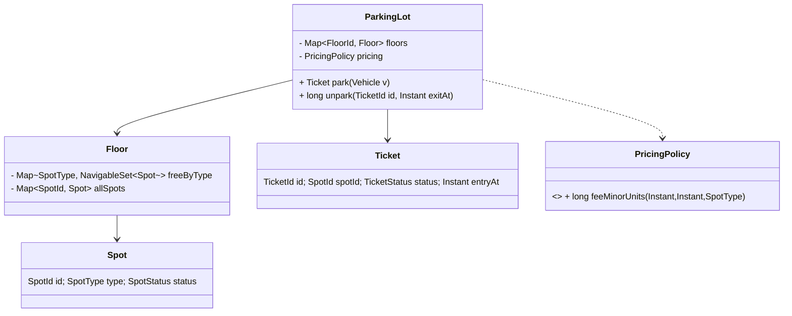
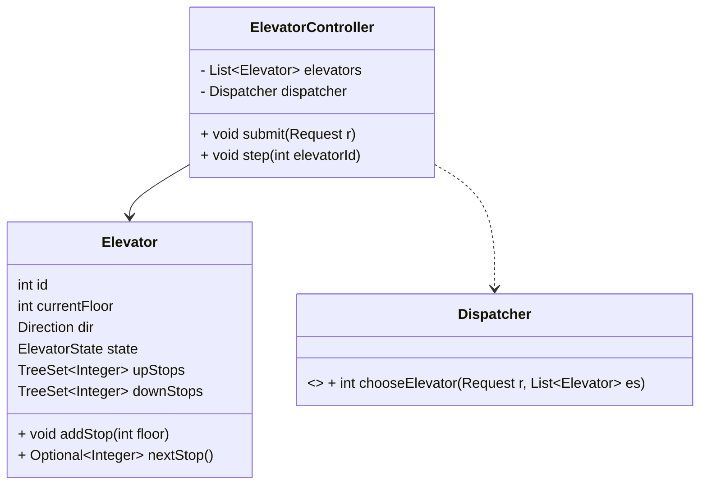
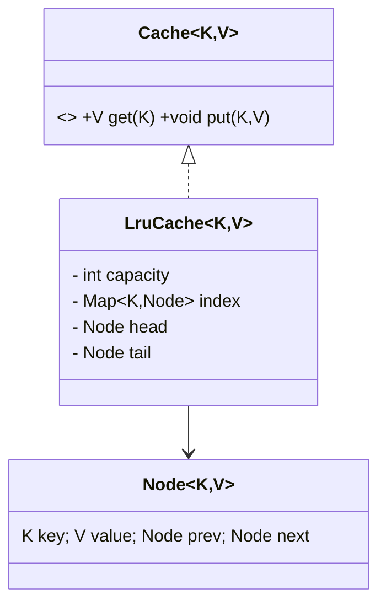
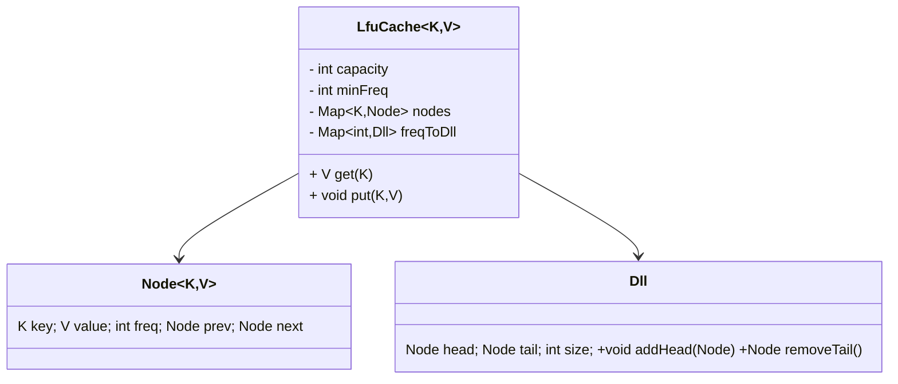
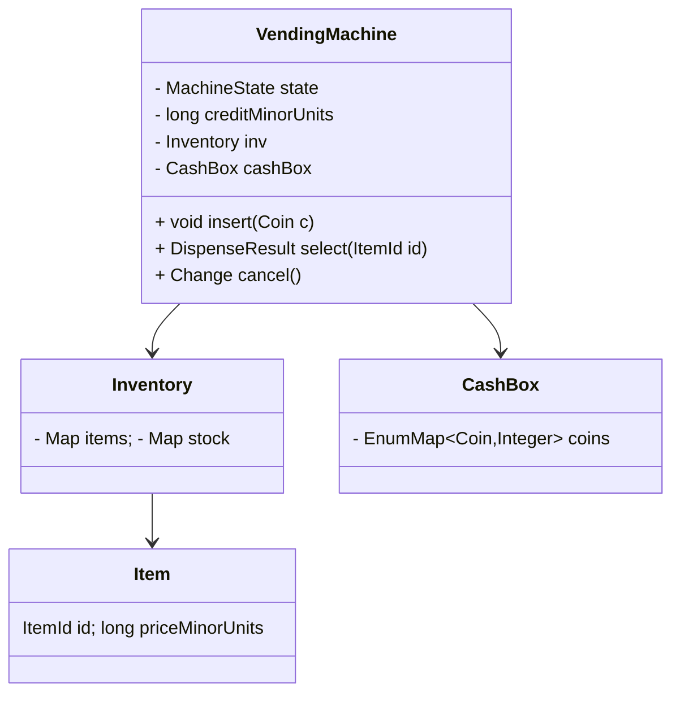
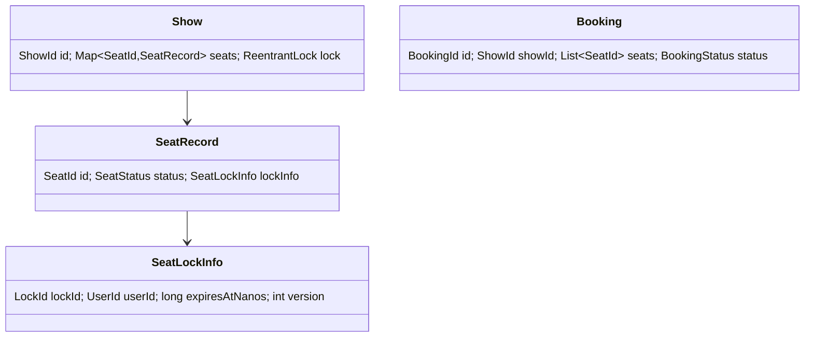
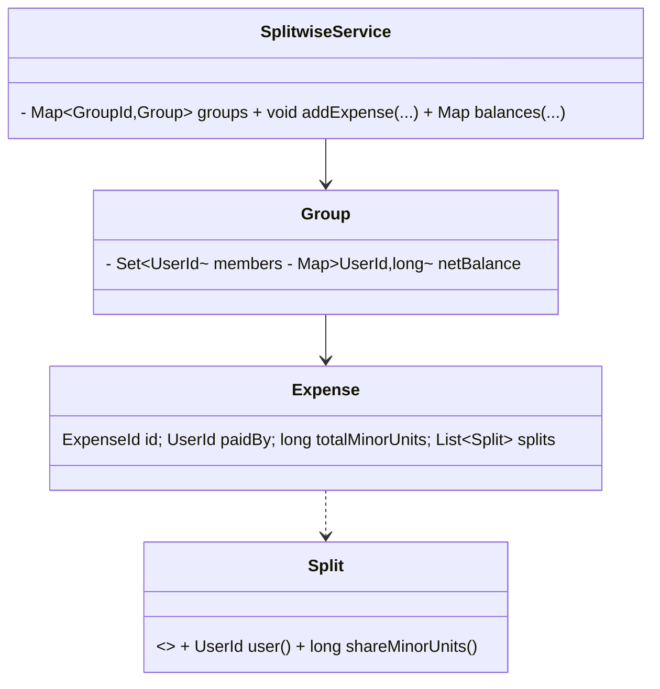
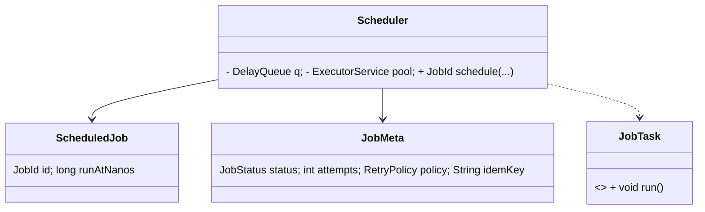
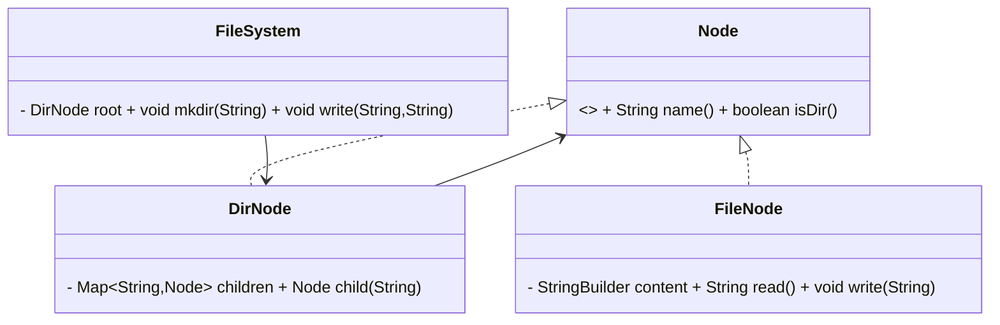
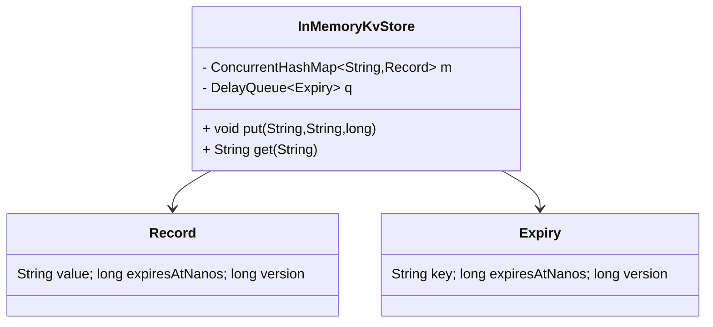

# SDE-2 LLD Interview Field Manual (India + MAANG)

## SECTION 0 — 60-MIN INTERVIEW EXECUTION SCRIPT (MANDATORY)

### Minute-by-minute playbook (0–60)

| Timebox | Your goal | What to ask | What to draw | What to code |
|---|---|---|---|---|
| 0–5 | Nail scope + constraints. Prevent rework. | “Single JVM?” “In-memory only?” “Concurrency expectations?” “Latency target?” “Failure handling?” “Any hard constraints (money precision, TTL, ordering)?” | 1 box: System boundary. 3 bullets: Must/Should/Won’t. | Nothing. |
| 5–12 | Lock requirements + invariants. | “What MUST never happen?” “What are valid states?” “What’s the atomic unit?” “What is the single source of truth?” | Requirements table + 3–5 invariants. | Nothing. |
| 12–22 | Build the domain model. No diagrams = fail. | “What are the entities?” “IDs?” “State transitions?” “Which DS holds truth?” | Class table (Class → responsibility → key fields). State table (if applicable). DS list with complexity notes. | Interfaces + enums + exceptions stubs. |
| 22–40 | Convert model to an executable plan. | “What races exist?” “What is locked?” “What is idempotent?” “How do we clean TTL?” | Concurrency plan: atomic unit + locks. Sequence of core operations (6–10 bullets). | Hardest 1–2 methods only. Core algorithm. |
| 40–60 | Make it interview-complete. | “Edge cases?” “How do you test?” “What breaks at scale?” | Edge-case list + tiny testing checklist. Optional “Scale Extension” bullets. | Minimal runnable skeleton + 1–2 tests (pseudo is ok). |

### Whiteboard checklist before you stop (no excuses)

- Invariants: wrote 3–5 enforceable rules. Verified your code enforces them.
- State model: listed states + allowed transitions (or explicitly “stateless”).
- Data structures: named each DS, why, and the key ops + complexity (at least for the hot path). HashMap average O(1) for get/put if hashing disperses well. citeturn0search0
- Concurrency: stated atomic unit + critical section + lock primitive + lock granularity. ReentrantLock exists; ReadWriteLock is read-shared / write-exclusive. citeturn1search2turn1search14
- Idempotency: if any “confirm/payment/execute” operation exists, you have an idempotency key map.
- Money: never `double`. Use `long minorUnits` or BigDecimal. BigDecimal exists for exact decimal arithmetic (don’t use `double` for currency). citeturn2search3
- Edge cases: at least 8. Includes duplicates + TTL expiry + invalid IDs + concurrent calls.
- Scale extension: max 5 bullets. Only at the end.

## SECTION 1 — UNIVERSAL TOOLKIT (MANDATORY)

### A) Invariants cheat-sheet (reusable patterns)

Use these as “enforceable rules” (each must be checkable in code):

1. **Uniqueness (ID):** `entityId` is globally unique within the service.
2. **Uniqueness (composite):** `(scopeId, naturalKey)` unique (e.g., `(showId, seatId)`).
3. **Capacity bound:** `size <= capacity` always.
4. **Non-negative counters:** stock, tokens, balances never go negative.
5. **Conservation of money:** sum(credits) − sum(debits) == 0 within a closed ledger.
6. **Split sum:** sum(splits) == totalAmount (after deterministic rounding policy).
7. **Single ownership:** a resource is owned by at most one holder at a time.
8. **State validity:** entity must be in allowed state to accept an operation.
9. **Monotonic state:** state only moves forward (no “PAID → ACTIVE”).
10. **Timestamp monotonicity per entity:** `updatedAt` never decreases.
11. **Idempotency:** same `(idempotencyKey)` produces the same effect/result.
12. **Exactly-once side effect (local):** a job/event is applied at most once (guarded by a committed flag).
13. **TTL correctness:** expired records behave as absent.
14. **No orphan references:** child points to parent that exists; parent contains child.
15. **Index consistency:** auxiliary indices reflect base data (update both or neither).
16. **Ordering invariant:** list order = recency/frequency ordering definition.
17. **Min/Max invariant:** `minFreq` points to smallest freq bucket that is non-empty.
18. **Lock invariant:** all writes of a shared structure happen under the same lock.
19. **Immutability:** IDs are immutable once assigned.
20. **Cancellation safety:** canceled task never executes (or, if executing, completion is ignored).

### B) Concurrency cheat-sheet

**Lock granularity rules**
- Start with **per-entity lock** (e.g., per `showId`, per `groupId`, per `bucketKey`). Avoid global locks unless the DS has a global ordering constraint (LRU/LFU).
- If you need many reads + few writes, use **ReadWriteLock** (read shared, write exclusive). citeturn1search14
- If you need strict atomic update across multiple structures, use **one lock covering all of them**.

**Atomic transitions and race conditions**
- Define **atomic unit** first: “the smallest thing that must be consistent”.
- Typical races:
  - Check-then-act: two threads both see AVAILABLE then both reserve.
  - Lost update: token refill computed twice with stale timestamp.
  - ABA: TTL expiry event deletes a key that was overwritten after scheduling.
- Fixes:
  - Single critical section for check+update.
  - Versioning (“generation”/“epoch”) for TTL and retries.
  - Per-entity locks (ReentrantLock) for multi-field transitions. citeturn1search2

**Idempotency keys + retry semantics**
- **At-least-once retries** are normal (client timeouts). Your server must dedupe with `(idempotencyKey → result)`. citeturn3search2
- Guarantee **exactly-once effects** locally by enforcing: “effect applied iff key not seen”.
- Idempotency key storage:
  - In-memory map: fast, but lost on restart (fine for single-JVM interview).
  - Value: final response object + status.

**Optimistic vs pessimistic locking**
- Use **pessimistic** (locks) when:
  - Contention is expected.
  - Conflicts are expensive (seat booking).
- Use **optimistic** (version compare) when:
  - Conflicts are rare.
  - Read-heavy, write-light.
- Interview cheat: In-memory LLD usually prefers **pessimistic per-entity locks** (simpler, correct).

### C) Data-structure decision table (with complexity)

| DS | Use when | Key operations | Complexity (typical) |
|---|---|---|---|
| TreeSet | You need a sorted set + range queries + next/prev. | add/remove/contains | O(log n) guaranteed for basic ops in TreeSet. citeturn0search9 |
| Heap (PriorityQueue) | You need min/max by priority with fast top. | offer/poll/peek | offer/poll/add = O(log n), peek = O(1). citeturn1search1 |
| Deque (ArrayDeque) | You need fast head/tail ops, sliding window logs. | addFirst/addLast/removeFirst/removeLast | Most ops amortized constant time. citeturn1search0 |
| HashMap | You need key → value lookup. | get/put/remove | get/put are constant-time on average if hashing disperses well. citeturn0search0 |
| LinkedHashMap | You need map + stable iteration order (insertion or access). Great for LRU. | get/put with access-order | Has access-order mode suited for LRU caches. citeturn0search6 |

### D) Common interview traps (Top 15) + how interviewer detects it

1. **No invariants.** They ask: “What must never break?” You stare.
2. **No atomic unit.** They ask: “What do you lock?” You say “synchronized everything”.
3. **Using `double` for money.** They ask: “Rounding?” You panic. (Use long minorUnits / BigDecimal.)
4. **Check-then-act race.** They ask: “Two users book same seat?” You say “it won’t happen”.
5. **TTL without cleanup.** They ask: “How does it expire?” You say “cron?” (in-memory: DelayQueue/thread). citeturn2search1
6. **Wrong lock granularity.** They ask: “Throughput?” You used one global lock.
7. **No idempotency on confirm/execute.** They ask: “Client retries?” You create duplicates. citeturn3search2
8. **State machine not explicit.** They ask: “Can PAID be canceled?” You haven’t modeled state.
9. **Inconsistent indexes.** They ask: “What if map says occupied but set says free?”
10. **Silent failure policy.** They ask: “What if queue is full?” You never decided.
11. **No deterministic rounding.** They ask: “Percent split of ₹100?” You handwave.
12. **Hardcoding time with `currentTimeMillis` for durations.** They ask: “Clock changes?” Use monotonic time for intervals.
13. **Forgetting complexity.** They ask: “What’s hot path complexity?” You guess.
14. **Overusing patterns.** They ask: “Why Strategy here?” You can’t justify.
15. **Coding too much.** They stop you: “I only wanted core method.”

## SECTION 2 — TIER-0 CASE STUDIES (DEEP) (MANDATORY)

**Case 1: Parking Lot**

1) Problem statement (2–3 lines)  
Design an in-memory parking lot system that allocates spots to vehicles and charges fees on exit. Support multiple floors and spot types. Handle concurrent entry/exit.

2) Requirements: Must / Should / Won’t (bullets)  
- **Must:** park vehicle, issue ticket, unpark with fee, track occupancy, reject when full.  
- **Should:** support multiple spot sizes, multi-floor selection, hourly pricing, lost-ticket handling.  
- **Won’t:** online payments, distributed consistency, dynamic maps.

3) Invariants (3–5 bullets) — enforceable, not vague  
- A spot is either FREE or OCCUPIED; never both.  
- A ticket in ACTIVE state references exactly one OCCUPIED spot.  
- Occupied spot count per (floor, spotType) never exceeds capacity.  
- Fee computed for a ticket is based on entryTime and exitTime; feeMinorUnits ≥ 0.  
- A ticket transitions ACTIVE → PAID → CLOSED only.

4) Domain model (table): Class/Interface/Enum → Responsibility → Key fields  

| Type | Responsibility | Key fields |
|---|---|---|
| `ParkingLot` | Root aggregate | `Map<FloorId, Floor> floors`, `PricingPolicy pricing` |
| `Floor` | Holds spots by type | `Map<SpotType, NavigableSet<Spot>> freeByType`, `Map<SpotId, Spot> allSpots` |
| `Spot` | Physical spot | `SpotId id`, `SpotType type`, `SpotStatus status` |
| `Ticket` | Parking session | `TicketId id`, `Vehicle vehicle`, `SpotId spotId`, `Instant entryAt`, `TicketStatus status` |
| `Vehicle` | Vehicle info | `String plate`, `VehicleType type` |
| `PricingPolicy` (interface) | Fee calculation | `long feeMinorUnits(entryAt, exitAt, SpotType)` |
| `SpotType` (enum) | Spot size/type | `BIKE`, `CAR`, `SUV` |
| `SpotStatus` (enum) | Spot state | `FREE`, `OCCUPIED` |
| `TicketStatus` (enum) | Ticket state | `ACTIVE`, `PAID`, `CLOSED` |



5) Public APIs (method signatures in Java)
```java
Ticket park(Vehicle vehicle, SpotType preferred);
long unpark(TicketId ticketId, Instant exitAt);
Optional<Ticket> getTicket(TicketId ticketId);
int getFreeCount(FloorId floorId, SpotType type);
```

6) State model (if applicable): states + transitions (table)

| Entity | State | Allowed transitions |
|---|---|---|
| `Spot` | FREE | FREE → OCCUPIED |
| `Spot` | OCCUPIED | OCCUPIED → FREE |
| `Ticket` | ACTIVE | ACTIVE → PAID |
| `Ticket` | PAID | PAID → CLOSED |

7) Data structures: (what, why, complexity)  
- `HashMap` for `ticketId → Ticket` lookup (avg O(1)). citeturn0search0  
- `NavigableSet` (`TreeSet`) per (floor,type) to pick a deterministic “best” free spot (O(log n) add/remove). citeturn0search9

8) Concurrency plan (must include):  
- **Atomic unit (what is locked):** (floorId, spotType) free-spot set + spot status update.  
- **Critical section:** select a free spot → mark OCCUPIED → remove from free set → create ACTIVE ticket.  
- **Lock granularity + exact primitive:** `ReentrantLock` per (floorId, spotType) bucket. citeturn1search2  
- **Idempotency key or unique constraint (if applicable):** ticketId is unique; `unpark(ticketId)` is idempotent if ticket already CLOSED (return same fee).

9) Core algorithm explained in 6–10 bullets (what you would code)  
- Validate preferred spot type exists.  
- Acquire bucket lock for (chosen floor, type).  
- If free set empty → throw `LotFullException`.  
- Pop first spot from TreeSet.  
- Mark spot OCCUPIED.  
- Create ticket with entryAt=now, status ACTIVE.  
- Release lock; return ticket.  
- For unpark: lock bucket by spot.type, verify ticket ACTIVE/PAID, compute fee, mark PAID then CLOSED, free spot.

10) Minimal Java skeleton (40–90 lines):
```java
package com.lld.parkinglot;

import java.time.Instant;
import java.util.*;
import java.util.concurrent.atomic.AtomicLong;
import java.util.concurrent.locks.ReentrantLock;

class LotFullException extends RuntimeException { LotFullException(String m){super(m);} }
class TicketNotFoundException extends RuntimeException { TicketNotFoundException(String m){super(m);} }
class InvalidTicketStateException extends RuntimeException { InvalidTicketStateException(String m){super(m);} }

enum SpotType { BIKE, CAR, SUV }
enum SpotStatus { FREE, OCCUPIED }
enum TicketStatus { ACTIVE, PAID, CLOSED }

record TicketId(long value) {}
record SpotId(long value) {}
record FloorId(int value) {}
record Vehicle(String plate, String type) {}

interface PricingPolicy {
  long feeMinorUnits(Instant entryAt, Instant exitAt, SpotType spotType);
}

final class ParkingLot {
  private final Map<SpotId, Spot> spots = new HashMap<>();
  private final Map<TicketId, Ticket> tickets = new HashMap<>();
  private final Map<SpotType, NavigableSet<Spot>> freeByType = new EnumMap<>(SpotType.class);
  private final Map<SpotType, ReentrantLock> locks = new EnumMap<>(SpotType.class);
  private final AtomicLong ticketSeq = new AtomicLong(1);
  private final PricingPolicy pricing;

  ParkingLot(PricingPolicy pricing) {
    this.pricing = pricing;
    for (SpotType t : SpotType.values()) {
      freeByType.put(t, new TreeSet<>(Comparator.comparingLong(s -> s.id.value())));
      locks.put(t, new ReentrantLock());
    }
  }

  Ticket park(Vehicle v, SpotType type, Instant now) {
    ReentrantLock lock = locks.get(type);
    lock.lock();
    try {
      NavigableSet<Spot> free = freeByType.get(type);
      if (free.isEmpty()) throw new LotFullException("No spot for " + type);
      Spot spot = free.pollFirst();
      spot.status = SpotStatus.OCCUPIED;
      TicketId tid = new TicketId(ticketSeq.getAndIncrement());
      Ticket t = new Ticket(tid, spot.id, type, now, TicketStatus.ACTIVE);
      tickets.put(tid, t);
      return t;
    } finally { lock.unlock(); }
  }

  long unpark(TicketId tid, Instant exitAt) {
    Ticket t = tickets.get(tid);
    if (t == null) throw new TicketNotFoundException("ticket=" + tid.value());
    if (t.status == TicketStatus.CLOSED) return 0L; // idempotent simplification
    if (t.status != TicketStatus.ACTIVE) throw new InvalidTicketStateException("status=" + t.status);

    ReentrantLock lock = locks.get(t.spotType);
    lock.lock();
    try {
      long fee = pricing.feeMinorUnits(t.entryAt, exitAt, t.spotType);
      Spot spot = spots.get(t.spotId);
      spot.status = SpotStatus.FREE;
      freeByType.get(t.spotType).add(spot);
      t.status = TicketStatus.CLOSED;
      return fee;
    } finally { lock.unlock(); }
  }

  static final class Spot { final SpotId id; final SpotType type; SpotStatus status;
    Spot(SpotId id, SpotType type){ this.id=id; this.type=type; this.status=SpotStatus.FREE; } }
  static final class Ticket {
    final TicketId id; final SpotId spotId; final SpotType spotType; final Instant entryAt; TicketStatus status;
    Ticket(TicketId id, SpotId sid, SpotType st, Instant at, TicketStatus s){ this.id=id; this.spotId=sid; this.spotType=st; this.entryAt=at; this.status=s; }
  }
}
```

11) Edge cases (at least 8)  
- Parking lot full for requested type.  
- Vehicle tries to park twice (same plate) — decide policy.  
- Ticket not found on exit.  
- Exit called twice (idempotency).  
- Clock skew / exitAt < entryAt (reject).  
- Spot freed but not re-added to free set (index consistency).  
- Concurrent park operations picking same spot (lock correctness).  
- Lost ticket (should: compute max fee / manual override).

12) Interviewer grilling pack:  
- **Q1:** How do you pick “best” spot (nearest gate)?  
  - **Strong Yes:** Add a `Comparator` per gate (or store distance per spot). Keep free spots as TreeSet ordered by that metric; selection stays O(log n).  
- **Q2:** What is the atomic unit?  
  - **Strong Yes:** Per (floor,type) free-set + spot-status update; ticket creation belongs inside the same critical section.  
- **Q3:** What prevents double allocation?  
  - **Strong Yes:** Single lock for that bucket; check+poll+mark OCCUPIED is one critical section.  
- **Q4:** How do you handle pricing changes?  
  - **Strong Yes:** Pricing is an interface; ticket stores entry time; fee computed at exit based on policy version/time.  
- **Q5:** What about reservations?  
  - **Strong Yes:** Add SpotStatus RESERVED and a reservation map keyed by reservationId; allocate only from FREE.  
- **Q6:** Can you support multi-lot?  
  - **Strong Yes:** ParkingLot becomes per facility; a top-level `ParkingService` routes by lotId.  
- **Q7:** What breaks in your in-memory approach?  
  - **Strong Yes:** Restart loses tickets/occupancy. Persist ticket+spot state in DB; keep same domain model.

13) Scale Extension (optional, max 5 bullets):  
- Persist tickets/spots in DB; add unique constraint on `spotId` occupancy.  
- Use Redis for “available spot” sets per type; atomic pop.  
- Multiple entry gates: shard locks by floor/type to reduce contention.  
- Emit events (ticketCreated, spotFreed) to a queue for analytics.  
- Add reconciliation job to detect spot index drift.

---

**Case 2: Elevator Controller (SCAN/LOOK dispatch)**

1) Problem statement (2–3 lines)  
Design an elevator controller for a building with multiple elevators. Handle hall calls (up/down) and car calls. Use SCAN/LOOK-style dispatch to minimize travel and avoid starvation.

2) Requirements: Must / Should / Won’t (bullets)  
- **Must:** accept hall + car requests, assign to an elevator, produce next-stop sequence.  
- **Should:** implement LOOK (reverse at last request), handle multiple elevators, prevent starvation.  
- **Won’t:** fire alarms, weight sensors, distributed coordination.

3) Invariants (3–5 bullets) — enforceable, not vague  
- Elevator door cannot be OPEN while MOVING.  
- Each request is either PENDING, ASSIGNED, or SERVED; not multiple.  
- For a given elevator: `upStops` contains only floors > currentFloor; `downStops` only floors < currentFloor.  
- LOOK direction reversal occurs only when no further stops exist in current direction.

4) Domain model (table): Class/Interface/Enum → Responsibility → Key fields  

| Type | Responsibility | Key fields |
|---|---|---|
| `ElevatorController` | Orchestrates elevators | `List<Elevator> elevators`, `Dispatcher dispatcher` |
| `Elevator` | Manages movement/doors | `int id`, `int currentFloor`, `Direction dir`, `ElevatorState state`, `TreeSet<Integer> upStops`, `TreeSet<Integer> downStops` |
| `Dispatcher` (interface) | Assign request to elevator | `int chooseElevator(Request req)` |
| `Request` | Hall/car request | `RequestId id`, `int floor`, `Direction desiredDir`, `RequestType type` |
| `Direction` (enum) | Movement | `UP`, `DOWN` |
| `ElevatorState` (enum) | Elevator state | `IDLE`, `MOVING`, `DOOR_OPEN` |
| `RequestStatus` (enum) | Tracking | `PENDING`, `ASSIGNED`, `SERVED` |



5) Public APIs (method signatures in Java)
```java
void submitHallCall(int floor, Direction direction);
void submitCarCall(int elevatorId, int floor);
int getCurrentFloor(int elevatorId);
ElevatorSnapshot getSnapshot(int elevatorId);
```

6) State model (if applicable): states + transitions (table)

| State | Event | Next state |
|---|---|---|
| IDLE | stop added | MOVING |
| MOVING | arrived at stop | DOOR_OPEN |
| DOOR_OPEN | door timeout/close | MOVING or IDLE |

7) Data structures: (what, why, complexity)  
- Two `TreeSet<Integer>` per elevator: next higher stop, next lower stop. add/contains/remove O(log n). citeturn0search9  
- LOOK reverses at last request instead of building extremes (LOOK vs SCAN concept). citeturn3search5

8) Concurrency plan (must include):  
- **Atomic unit (what is locked):** One elevator’s state + its stop sets.  
- **Critical section:** addStop + possibly change from IDLE to MOVING + compute nextStop.  
- **Lock granularity + exact primitive:** `ReentrantLock` per elevator. citeturn1search2  
- **Idempotency key or unique constraint (if applicable):** requestId uniqueness; dedupe identical (elevatorId,floor) stop insertion.

9) Core algorithm explained in 6–10 bullets (what you would code)  
- Maintain `upStops` ascending, `downStops` descending.  
- When adding stop:
  - If floor > current → add to upStops.
  - If floor < current → add to downStops.
  - If floor == current → open door immediately if safe.  
- `nextStop()`:
  - If dir==UP and upStops non-empty → smallest in upStops.
  - If dir==UP and upStops empty but downStops non-empty → dir=DOWN, take first in downStops.
  - Symmetric for DOWN.  
- `step()` moves one “tick”: if at stop, DOOR_OPEN; else move one floor toward nextStop.  
- Dispatcher chooses elevator by minimal “distance with direction bias”.

10) Minimal Java skeleton (40–90 lines):
```java
package com.lld.elevator;

import java.util.*;
import java.util.concurrent.locks.ReentrantLock;

class InvalidFloorException extends RuntimeException { InvalidFloorException(String m){super(m);} }
class ElevatorNotFoundException extends RuntimeException { ElevatorNotFoundException(String m){super(m);} }
class IllegalDoorStateException extends RuntimeException { IllegalDoorStateException(String m){super(m);} }

enum Direction { UP, DOWN }
enum ElevatorState { IDLE, MOVING, DOOR_OPEN }

final class Elevator {
  final int id;
  int currentFloor;
  Direction dir = Direction.UP;
  ElevatorState state = ElevatorState.IDLE;
  final TreeSet<Integer> upStops = new TreeSet<>();
  final TreeSet<Integer> downStops = new TreeSet<>(Comparator.reverseOrder());
  final ReentrantLock lock = new ReentrantLock();

  Elevator(int id, int start) { this.id=id; this.currentFloor=start; }

  void addStop(int floor) {
    lock.lock();
    try {
      if (floor == currentFloor) { state = ElevatorState.DOOR_OPEN; return; }
      if (floor > currentFloor) upStops.add(floor); else downStops.add(floor);
      if (state == ElevatorState.IDLE) state = ElevatorState.MOVING;
    } finally { lock.unlock(); }
  }

  Optional<Integer> nextStop() {
    lock.lock();
    try {
      if (dir == Direction.UP) {
        if (!upStops.isEmpty()) return Optional.of(upStops.first());
        if (!downStops.isEmpty()) { dir = Direction.DOWN; return Optional.of(downStops.first()); }
      } else {
        if (!downStops.isEmpty()) return Optional.of(downStops.first());
        if (!upStops.isEmpty()) { dir = Direction.UP; return Optional.of(upStops.first()); }
      }
      state = ElevatorState.IDLE;
      return Optional.empty();
    } finally { lock.unlock(); }
  }

  void stepOneFloor() {
    lock.lock();
    try {
      if (state == ElevatorState.DOOR_OPEN) throw new IllegalDoorStateException("close door first");
      Optional<Integer> ns = nextStop();
      if (ns.isEmpty()) return;
      int target = ns.get();
      currentFloor += Integer.compare(target, currentFloor);
      if (currentFloor == target) {
        upStops.remove(target); downStops.remove(target);
        state = ElevatorState.DOOR_OPEN;
      }
    } finally { lock.unlock(); }
  }
}
```

11) Edge cases (at least 8)  
- Duplicate stop insertions.  
- Two simultaneous hall calls at same floor/direction.  
- Request for invalid floor (<0 or >max).  
- Elevator ID not found.  
- Elevator idle with pending stops (should not happen if invariant enforced).  
- Door open request while moving.  
- Starvation: continuous UP calls; ensure occasional reversal when downStops exist.  
- Multiple elevators pick same request (avoid by assignment state).

12) Interviewer grilling pack:  
- **Q1:** Why LOOK instead of SCAN?  
  - **Strong Yes:** LOOK reverses at last requested floor and avoids traveling to extremes with no requests, reducing wasted travel. citeturn3search5  
- **Q2:** How do you avoid duplicate servicing?  
  - **Strong Yes:** Request has status; dispatcher marks ASSIGNED under controller lock before enqueueing to elevator.  
- **Q3:** What’s your atomic unit?  
  - **Strong Yes:** Per elevator state + stop sets; one lock per elevator.  
- **Q4:** How to choose elevator?  
  - **Strong Yes:** Compute estimated cost based on direction and stop sets; pick min cost.  
- **Q5:** How to support express elevators?  
  - **Strong Yes:** Add elevator capabilities (served floors) and filter candidates.  
- **Q6:** What if new stop arrives while moving?  
  - **Strong Yes:** Insert into appropriate set; nextStop recalculates each tick.  
- **Q7:** Testing strategy?  
  - **Strong Yes:** Deterministic step simulation; verify stop order and state transitions.

13) Scale Extension (optional, max 5 bullets):  
- Central controller becomes single bottleneck; shard by elevator group/zone.  
- Persist request states; replay on restart.  
- Use event-driven simulation (timer-wheel) for ticks.  
- Add metrics: wait time, ride time.  
- Add priority (firefighter mode) as override queue.

---

**Case 3: LRU Cache**

1) Problem statement (2–3 lines)  
Design an in-memory LRU cache with fixed capacity. Support O(1) get/put and evict least-recently-used key on overflow.

2) Requirements: Must / Should / Won’t (bullets)  
- **Must:** `get`, `put`, eviction by LRU, capacity bound.  
- **Should:** `remove`, `clear`, optional thread-safety.  
- **Won’t:** persistence, distributed cache, TTL.

3) Invariants (3–5 bullets) — enforceable, not vague  
- Cache size never exceeds capacity.  
- Each key appears at most once in map and list.  
- Doubly linked list order is from MRU(head) → LRU(tail).  
- On `get(k)` hit, node becomes MRU.

4) Domain model (table): Class/Interface/Enum → Responsibility → Key fields  

| Type | Responsibility | Key fields |
|---|---|---|
| `Cache<K,V>` (interface) | Cache contract | `get`, `put`, `remove` |
| `LruCache<K,V>` | Implementation | `int capacity`, `Map<K,Node> index`, `Node head/tail` |
| `Node<K,V>` | Doubly-list node | `K key`, `V value`, `Node prev/next` |



5) Public APIs (method signatures in Java)
```java
V get(K key);
void put(K key, V value);
boolean remove(K key);
int size();
```

6) State model (if applicable): states + transitions (table)  
N/A (stateless per entry; recency is ordering metadata).

7) Data structures: (what, why, complexity)  
- `HashMap<K,Node>` for O(1) lookup. citeturn0search0  
- Custom doubly linked list for O(1) move-to-front and O(1) tail eviction.

8) Concurrency plan (must include):  
- **Atomic unit (what is locked):** whole cache (map + list must stay consistent).  
- **Critical section:** read node → mutate list pointers → possibly evict tail and mutate map.  
- **Lock granularity + exact primitive:** single `ReentrantLock` inside cache. citeturn1search2  
- **Idempotency key or unique constraint (if applicable):** not applicable.

9) Core algorithm explained in 6–10 bullets (what you would code)  
- `get(k)`:
  - if missing → return null
  - detach node
  - attach at head
  - return value  
- `put(k,v)`:
  - if exists → update value, move to head  
  - else:
    - if size==capacity → evict tail: remove from map + detach from list
    - create new node, add to head, add to map

10) Minimal Java skeleton (40–90 lines):
```java
package com.lld.cache;

import java.util.HashMap;
import java.util.Map;
import java.util.concurrent.locks.ReentrantLock;

class CapacityExceededException extends RuntimeException { CapacityExceededException(String m){super(m);} }
class NullKeyException extends RuntimeException { NullKeyException(String m){super(m);} }
class InconsistentListException extends RuntimeException { InconsistentListException(String m){super(m);} }

interface Cache<K,V> { V get(K k); void put(K k, V v); boolean remove(K k); int size(); }

final class LruCache<K,V> implements Cache<K,V> {
  private final int capacity;
  private final Map<K, Node<K,V>> index = new HashMap<>();
  private Node<K,V> head, tail;
  private final ReentrantLock lock = new ReentrantLock();

  LruCache(int capacity) {
    if (capacity < 0) throw new IllegalArgumentException("capacity");
    this.capacity = capacity;
  }

  public V get(K k) {
    if (k == null) throw new NullKeyException("null key");
    lock.lock();
    try {
      Node<K,V> n = index.get(k);
      if (n == null) return null;
      moveToHead(n);
      return n.v;
    } finally { lock.unlock(); }
  }

  public void put(K k, V v) {
    if (k == null) throw new NullKeyException("null key");
    lock.lock();
    try {
      Node<K,V> n = index.get(k);
      if (n != null) { n.v = v; moveToHead(n); return; }
      if (capacity == 0) return;
      if (index.size() == capacity) evictTail();
      Node<K,V> nn = new Node<>(k, v);
      addHead(nn);
      index.put(k, nn);
    } finally { lock.unlock(); }
  }

  private void evictTail() {
    if (tail == null) throw new InconsistentListException("tail null");
    index.remove(tail.k);
    removeNode(tail);
  }

  private void moveToHead(Node<K,V> n){ removeNode(n); addHead(n); }
  private void addHead(Node<K,V> n){
    n.p = null; n.n = head;
    if (head != null) head.p = n;
    head = n;
    if (tail == null) tail = n;
  }
  private void removeNode(Node<K,V> n){
    if (n.p != null) n.p.n = n.n; else head = n.n;
    if (n.n != null) n.n.p = n.p; else tail = n.p;
    n.p = n.n = null;
  }

  public boolean remove(K k){
    lock.lock();
    try {
      Node<K,V> n = index.remove(k);
      if (n == null) return false;
      removeNode(n);
      return true;
    } finally { lock.unlock(); }
  }
  public int size(){ lock.lock(); try { return index.size(); } finally { lock.unlock(); } }

  static final class Node<K,V> { final K k; V v; Node<K,V> p,n; Node(K k,V v){this.k=k; this.v=v;} }
}
```

11) Edge cases (at least 8)  
- capacity = 0.  
- get missing returns null.  
- put existing key updates recency.  
- repeated get should not break list pointers.  
- remove head/tail/middle node.  
- null key policy.  
- concurrent get+put without lock (race) — must be locked.  
- memory leak if pointers not nulled (debug).

12) Interviewer grilling pack:  
- **Q1:** Can you implement using LinkedHashMap?  
  - **Strong Yes:** LinkedHashMap supports access-order iteration, suitable for LRU; override `removeEldestEntry`. citeturn0search6  
- **Q2:** Why a global lock?  
  - **Strong Yes:** Any access mutates recency ordering; per-key locks don’t help because list pointers are shared.  
- **Q3:** Complexity?  
  - **Strong Yes:** get/put/remove O(1) average; eviction O(1).  
- **Q4:** How to make it read-optimized?  
  - **Strong Yes:** You can relax strict LRU (sampled LRU) or batch recency updates; strict LRU needs writes on reads.  
- **Q5:** What invariant catches bugs?  
  - **Strong Yes:** map size == list size; head.prev==null; tail.next==null.  
- **Q6:** How do you test correctness?  
  - **Strong Yes:** deterministic sequence tests + pointer integrity assertions after each op.  
- **Q7:** What breaks with large values?  
  - **Strong Yes:** memory usage; add weight-based eviction.

13) Scale Extension (optional, max 5 bullets):  
- Use Redis with eviction policy (still same domain model: key/value, capacity).  
- Shard cache per key prefix to reduce lock contention.  
- Add TTL + background expiration.  
- Add metrics and hit rate tracking.  
- Add write-through backing store.

---

**Case 4: LFU Cache**

1) Problem statement (2–3 lines)  
Design an in-memory LFU cache with fixed capacity. Evict least-frequently-used key; break ties using LRU within the same frequency. Target O(1) get/put.

2) Requirements: Must / Should / Won’t (bullets)  
- **Must:** get/put, LFU eviction, tie-breaker by recency within freq, capacity bound.  
- **Should:** remove, peek, thread-safety.  
- **Won’t:** TTL, persistence, distributed.

3) Invariants (3–5 bullets) — enforceable, not vague  
- Cache size never exceeds capacity.  
- Each key exists in exactly one frequency bucket.  
- `minFreq` always equals the smallest frequency bucket that is non-empty.  
- Within a frequency bucket, ordering is LRU (head MRU, tail LRU).

4) Domain model (table): Class/Interface/Enum → Responsibility → Key fields  

| Type | Responsibility | Key fields |
|---|---|---|
| `LfuCache<K,V>` | Cache impl | `capacity`, `minFreq`, `Map<K,Node> nodes`, `Map<Integer,Dll> freqToDll` |
| `Node<K,V>` | Entry + freq | `K key`, `V value`, `int freq`, `Node prev/next` |
| `Dll` | Recency list per freq | `Node head/tail`, `int size` |



5) Public APIs (method signatures in Java)
```java
V get(K key);
void put(K key, V value);
boolean remove(K key);
int size();
```

6) State model (if applicable): states + transitions (table)  
N/A (frequency metadata changes; no explicit state machine).

7) Data structures: (what, why, complexity)  
- `HashMap<K, Node>` for lookup. citeturn0search0  
- `HashMap<freq, Dll>` for O(1) bucket transitions.  
- `minFreq` int for O(1) eviction target.

8) Concurrency plan (must include):  
- **Atomic unit (what is locked):** whole cache (nodes map + freq buckets + minFreq).  
- **Critical section:** get updates freq (removes from one list, adds to another, maybe updates minFreq).  
- **Lock granularity + exact primitive:** single `ReentrantLock` inside cache. citeturn1search2  
- **Idempotency key or unique constraint (if applicable):** not applicable.

9) Core algorithm explained in 6–10 bullets (what you would code)  
- `get` miss → null.  
- `get` hit:
  - remove node from freq bucket
  - if bucket empty and freq==minFreq → minFreq++
  - increment node.freq
  - add node to head of new freq bucket  
- `put`:
  - if capacity==0 → return
  - if key exists → update value + run get(key) logic to bump freq
  - else:
    - if size==capacity → evict tail from bucket `minFreq`
    - create node freq=1; add to bucket 1; minFreq=1

10) Minimal Java skeleton (40–90 lines):
```java
package com.lld.cache;

import java.util.HashMap;
import java.util.Map;
import java.util.concurrent.locks.ReentrantLock;

class LfuCapacityException extends RuntimeException { LfuCapacityException(String m){super(m);} }
class KeyNotFoundException extends RuntimeException { KeyNotFoundException(String m){super(m);} }
class CorruptBucketException extends RuntimeException { CorruptBucketException(String m){super(m);} }

final class LfuCache<K,V> {
  private final int capacity;
  private int minFreq = 0;
  private final Map<K, Node<K,V>> nodes = new HashMap<>();
  private final Map<Integer, Dll<K,V>> buckets = new HashMap<>();
  private final ReentrantLock lock = new ReentrantLock();

  LfuCache(int capacity){ this.capacity = Math.max(0, capacity); }

  public V get(K key){
    lock.lock();
    try {
      Node<K,V> n = nodes.get(key);
      if (n == null) return null;
      touch(n);
      return n.v;
    } finally { lock.unlock(); }
  }

  public void put(K key, V val){
    lock.lock();
    try {
      if (capacity == 0) return;
      Node<K,V> n = nodes.get(key);
      if (n != null) { n.v = val; touch(n); return; }
      if (nodes.size() == capacity) evict();
      Node<K,V> nn = new Node<>(key, val);
      nn.freq = 1; minFreq = 1;
      bucket(1).addHead(nn);
      nodes.put(key, nn);
    } finally { lock.unlock(); }
  }

  private void touch(Node<K,V> n){
    int f = n.freq;
    Dll<K,V> b = bucket(f);
    b.remove(n);
    if (f == minFreq && b.size == 0) minFreq++;
    n.freq++;
    bucket(n.freq).addHead(n);
  }

  private void evict(){
    Dll<K,V> b = bucket(minFreq);
    Node<K,V> victim = b.removeTail();
    if (victim == null) throw new CorruptBucketException("minFreq empty");
    nodes.remove(victim.k);
  }

  private Dll<K,V> bucket(int f){ return buckets.computeIfAbsent(f, __ -> new Dll<>()); }

  static final class Node<K,V> { final K k; V v; int freq=0; Node<K,V> p,n; Node(K k,V v){this.k=k; this.v=v;} }
  static final class Dll<K,V> {
    Node<K,V> head, tail; int size=0;
    void addHead(Node<K,V> x){ x.p=null; x.n=head; if(head!=null) head.p=x; head=x; if(tail==null) tail=x; size++; }
    void remove(Node<K,V> x){ if(x.p!=null) x.p.n=x.n; else head=x.n; if(x.n!=null) x.n.p=x.p; else tail=x.p; x.p=x.n=null; size--; }
    Node<K,V> removeTail(){ if(tail==null) return null; Node<K,V> x=tail; remove(x); return x; }
  }
}
```

11) Edge cases (at least 8)  
- capacity=0 behavior.  
- get should increase freq.  
- put existing increases freq.  
- eviction when multiple keys share minFreq → evict LRU within that freq.  
- minFreq update when bucket empties.  
- “freq bucket leak” where empty buckets remain (ok).  
- concurrency without lock breaks minFreq invariants.  
- large frequency growth (int overflow) — clamp or reset (mention).

12) Interviewer grilling pack:  
- **Q1:** Why LFU is harder than LRU?  
  - **Strong Yes:** get mutates both freq and recency-in-freq; needs two-level indexing to maintain O(1).  
- **Q2:** What ensures tie-breaker?  
  - **Strong Yes:** each freq bucket is an LRU list; evict tail of `minFreq`.  
- **Q3:** What is `minFreq` invariant?  
  - **Strong Yes:** always points to a non-empty bucket containing the global LFU keys.  
- **Q4:** How to test?  
  - **Strong Yes:** known sequences where frequencies diverge; assert evictions.  
- **Q5:** Can you do it with a TreeMap?  
  - **Strong Yes:** possible but becomes O(log n); this design is O(1).  
- **Q6:** What about aging?  
  - **Strong Yes:** add decay/epoch mechanism; not in core interview scope.  
- **Q7:** Thread-safety?  
  - **Strong Yes:** single lock; strict correctness.

13) Scale Extension (optional, max 5 bullets):  
- Shard cache by key to reduce lock contention.  
- Add admission policy (TinyLFU-style) before insert.  
- Add TTL per entry.  
- Persist to disk for warm start.  
- Use external cache (Redis) if cross-process required.

---

**Case 5: Vending Machine (state + change-making)**

1) Problem statement (2–3 lines)  
Design a vending machine that sells items, accepts coins, dispenses items, and returns change. Use explicit states and handle inability to make change.

2) Requirements: Must / Should / Won’t (bullets)  
- **Must:** insert coin, select item, dispense if paid, return change, cancel transaction.  
- **Should:** handle limited coin inventory for change, restock items/coins, out-of-service mode.  
- **Won’t:** card payments, remote inventory sync.

3) Invariants (3–5 bullets) — enforceable, not vague  
- `creditMinorUnits` is never negative.  
- Item stock never negative; dispense decrements exactly once.  
- If transaction completes, returned change + item price == inserted credit.  
- Machine can dispense only in appropriate state (HAS_CREDIT + selection valid).  
- Money uses `long minorUnits` (no `double`).

4) Domain model (table): Class/Interface/Enum → Responsibility → Key fields  

| Type | Responsibility | Key fields |
|---|---|---|
| `VendingMachine` | Orchestrates | `State state`, `long creditMinorUnits`, `Inventory inv`, `CashBox cashBox`, `Txn txn` |
| `Inventory` | Items + stock | `Map<ItemId, Item> items`, `Map<ItemId, Integer> stock` |
| `CashBox` | Coins inventory | `EnumMap<Coin, Integer> coins` |
| `Item` | Item meta | `ItemId id`, `String name`, `long priceMinorUnits` |
| `Coin` (enum) | Denominations | `ONE`, `TWO`, `FIVE`, `TEN` … with `valueMinorUnits` |
| `MachineState` (enum) | State machine | `IDLE`, `HAS_CREDIT`, `DISPENSING`, `RETURNING_CHANGE`, `OUT_OF_SERVICE` |



5) Public APIs (method signatures in Java)
```java
void insertCoin(Coin coin);
DispenseResult selectItem(ItemId itemId);
Change cancel();
void restockItem(ItemId itemId, int qty);
void restockCoin(Coin coin, int qty);
```

6) State model (if applicable): states + transitions (table)

| Current | Event | Next |
|---|---|---|
| IDLE | insertCoin | HAS_CREDIT |
| HAS_CREDIT | insertCoin | HAS_CREDIT |
| HAS_CREDIT | selectItem success | DISPENSING → RETURNING_CHANGE → IDLE |
| HAS_CREDIT | cancel | RETURNING_CHANGE → IDLE |
| * | serviceDown | OUT_OF_SERVICE |
| OUT_OF_SERVICE | serviceUp | IDLE |

7) Data structures: (what, why, complexity)  
- `EnumMap<Coin, Integer>` for coin inventory (fast, small enum).  
- `HashMap<ItemId, Item>` and stock map (avg O(1)). citeturn0search0

8) Concurrency plan (must include):  
- **Atomic unit (what is locked):** machine transaction (credit + selected item + coin inventory updates).  
- **Critical section:** selectItem: validate stock + credit; compute change; decrement stock; adjust coins; reset credit.  
- **Lock granularity + exact primitive:** single `ReentrantLock` on machine (one active txn at a time). citeturn1search2  
- **Idempotency key or unique constraint (if applicable):** transactionId helps dedupe duplicate `selectItem` calls; if same txn already completed, return same result.

9) Core algorithm explained in 6–10 bullets (what you would code)  
- On insertCoin:
  - if OUT_OF_SERVICE → reject  
  - increment credit  
  - add coin to cashBox  
  - state = HAS_CREDIT  
- On selectItem:
  - validate state HAS_CREDIT
  - validate stock>0
  - if credit < price → throw
  - compute change = credit - price
  - find coin combination using available coin inventory (greedy with availability)
  - if cannot make change → throw `CannotMakeChangeException`
  - decrement stock, decrement coins for change
  - reset credit; state back to IDLE  
- On cancel: return entire credit using available coins (or fail policy).

10) Minimal Java skeleton (40–90 lines):
```java
package com.lld.vending;

import java.util.EnumMap;
import java.util.Map;
import java.util.concurrent.locks.ReentrantLock;

class InvalidStateException extends RuntimeException { InvalidStateException(String m){super(m);} }
class OutOfStockException extends RuntimeException { OutOfStockException(String m){super(m);} }
class CannotMakeChangeException extends RuntimeException { CannotMakeChangeException(String m){super(m);} }

enum MachineState { IDLE, HAS_CREDIT, DISPENSING, RETURNING_CHANGE, OUT_OF_SERVICE }
enum Coin {
  ONE(100), TWO(200), FIVE(500), TEN(1000);
  final long v; Coin(long v){ this.v=v; }
}

record ItemId(String value) {}
record Item(ItemId id, String name, long priceMinorUnits) {}
record Change(Map<Coin,Integer> coins, long totalMinorUnits) {}
record DispenseResult(Item item, Change change) {}

final class VendingMachine {
  private final ReentrantLock lock = new ReentrantLock();
  private MachineState state = MachineState.IDLE;
  private long credit = 0L;
  private final Map<ItemId, Item> items;
  private final Map<ItemId, Integer> stock;
  private final EnumMap<Coin,Integer> cash = new EnumMap<>(Coin.class);

  VendingMachine(Map<ItemId, Item> items, Map<ItemId, Integer> stock){
    this.items = items; this.stock = stock;
    for (Coin c: Coin.values()) cash.put(c, 0);
  }

  void insertCoin(Coin c){
    lock.lock();
    try {
      if (state == MachineState.OUT_OF_SERVICE) throw new InvalidStateException("down");
      credit += c.v;
      cash.put(c, cash.get(c) + 1);
      state = MachineState.HAS_CREDIT;
    } finally { lock.unlock(); }
  }

  DispenseResult selectItem(ItemId id){
    lock.lock();
    try {
      if (state != MachineState.HAS_CREDIT) throw new InvalidStateException("state=" + state);
      Item it = items.get(id);
      int left = stock.getOrDefault(id, 0);
      if (left <= 0) throw new OutOfStockException("item=" + id.value());
      if (credit < it.priceMinorUnits()) throw new InvalidStateException("insufficient credit");
      long changeAmt = credit - it.priceMinorUnits();

      Change change = makeChange(changeAmt);
      stock.put(id, left - 1);
      credit = 0L;
      state = MachineState.IDLE;
      return new DispenseResult(it, change);
    } finally { lock.unlock(); }
  }

  private Change makeChange(long amt){
    EnumMap<Coin,Integer> out = new EnumMap<>(Coin.class);
    long remaining = amt;
    for (Coin c : new Coin[]{Coin.TEN, Coin.FIVE, Coin.TWO, Coin.ONE}) {
      int have = cash.get(c);
      int take = (int)Math.min(have, remaining / c.v);
      if (take > 0) { out.put(c, take); cash.put(c, have - take); remaining -= take * c.v; }
    }
    if (remaining != 0) throw new CannotMakeChangeException("cannot make=" + amt);
    return new Change(out, amt);
  }
}
```

11) Edge cases (at least 8)  
- Cannot make change due to coin shortage.  
- Cancel when machine lacks coins for refund (define policy).  
- Insert coin while dispensing (reject).  
- Select invalid itemId.  
- Out of stock mid-flow (reject).  
- credit exactly equals price (change=0).  
- Machine goes OUT_OF_SERVICE mid-transaction (refund policy).  
- Greedy fails for non-canonical denominations (mention limitation).

12) Interviewer grilling pack:  
- **Q1:** Why explicit states?  
  - **Strong Yes:** prevents illegal operations; state machine is enforceable and testable.  
- **Q2:** What’s the atomic unit?  
  - **Strong Yes:** entire transaction including stock + coins + credit must be consistent.  
- **Q3:** How do you guarantee change correctness?  
  - **Strong Yes:** invariant: returnedChange + price == initialCredit; verified in code.  
- **Q4:** Greedy correct always?  
  - **Strong Yes:** not always; for interview we assume canonical denominations; else need DP/backtracking.  
- **Q5:** Concurrency?  
  - **Strong Yes:** single machine lock; one active transaction.  
- **Q6:** How to test?  
  - **Strong Yes:** deterministic coin inventory; verify change composition and stock changes.  
- **Q7:** How do you avoid losing money if dispense fails?  
  - **Strong Yes:** do change computation before decrementing stock and before resetting credit; if fail, atomic rollback by not mutating.

13) Scale Extension (optional, max 5 bullets):  
- Persist transaction + inventory to DB for restart safety.  
- Use event log for audit (coins in/out).  
- Separate cashbox module with its own locking if multiple slots.  
- Add remote telemetry for stock.  
- Add multi-item cart (still same item/price domain).

---

**Case 6: BookMyShow Seat Locking (TTL + confirm)**

1) Problem statement (2–3 lines)  
Design seat selection with temporary locking (TTL) and final booking confirmation. Prevent double booking under concurrent users. Expired locks must release seats.

2) Requirements: Must / Should / Won’t (bullets)  
- **Must:** lock seats for user with TTL, confirm booking, auto-expire locks, prevent oversell.  
- **Should:** idempotent confirm, partial failure handling, query availability.  
- **Won’t:** payment gateway integration, distributed locks.

3) Invariants (3–5 bullets) — enforceable, not vague  
- A seat can be BOOKED only once per show.  
- A seat in LOCKED state has exactly one `lockId` and must have `expiresAt`.  
- Confirm succeeds iff all seats are LOCKED by that `lockId` and not expired.  
- Expired locks must transition seats LOCKED → AVAILABLE.  
- Idempotency: confirm with same `idempotencyKey` returns same booking.

4) Domain model (table): Class/Interface/Enum → Responsibility → Key fields  

| Type | Responsibility | Key fields |
|---|---|---|
| `Show` | Aggregate root per show | `ShowId id`, `Map<SeatId, SeatRecord> seats`, `ReentrantLock lock` |
| `SeatRecord` | Seat state | `SeatId id`, `SeatStatus status`, `SeatLockInfo lockInfo` |
| `SeatLockInfo` | Lock metadata | `LockId lockId`, `UserId userId`, `long expiresAtNanos`, `int version` |
| `Booking` | Final booking | `BookingId id`, `ShowId showId`, `List<SeatId> seats`, `BookingStatus status` |
| `SeatLockService` | Lock/confirm | `DelayQueue<ExpiryEvent> expiryQ`, maps for locks/bookings |
| `SeatStatus` (enum) | Seat status | `AVAILABLE`, `LOCKED`, `BOOKED` |
| `BookingStatus` (enum) | Booking status | `CONFIRMED`, `CANCELLED` |



5) Public APIs (method signatures in Java)
```java
LockId lockSeats(ShowId showId, UserId userId, List<SeatId> seatIds, long ttlMillis);
BookingId confirm(LockId lockId, String idempotencyKey);
void releaseExpiredLocks(); // background worker
SeatStatus getSeatStatus(ShowId showId, SeatId seatId);
```

6) State model (if applicable): states + transitions (table)

| Seat state | Event | Next |
|---|---|---|
| AVAILABLE | lockSeats | LOCKED |
| LOCKED | confirm | BOOKED |
| LOCKED | ttlExpired | AVAILABLE |
| BOOKED | (none) | BOOKED |

7) Data structures: (what, why, complexity)  
- `HashMap` for lockId → lock metadata (avg O(1)). citeturn0search0  
- `DelayQueue` to trigger expirations when delay expires. citeturn2search1

8) Concurrency plan (must include):  
- **Atomic unit (what is locked):** Show aggregate (all seat records for that show).  
- **Critical section:** validate all seats AVAILABLE → mark LOCKED → write lock metadata/version → enqueue expiry.  
- **Lock granularity + exact primitive:** `ReentrantLock` per `Show`. citeturn1search2  
- **Idempotency key or unique constraint (if applicable):** `idempotencyKey → bookingId` map; confirm is deduped like idempotent requests. citeturn3search2

9) Core algorithm explained in 6–10 bullets (what you would code)  
- `lockSeats`:
  - lock show
  - ensure every seat exists and status AVAILABLE
  - create lockId, set expiresAtNanos = now+ttl
  - for each seat: status=LOCKED, lockInfo=(lockId,user,expiresAt,version++)
  - store lockId → (showId, seatIds, expiresAt)
  - enqueue one expiry event per lockId (or per seat)  
- `confirm(lockId, idemKey)`:
  - if idemKey exists return stored bookingId
  - lock show
  - validate lock not expired
  - validate seats are LOCKED and lockId matches
  - mark all seats BOOKED, clear lockInfo
  - create booking, store idemKey → bookingId  
- Expiry worker:
  - take from DelayQueue
  - lock show
  - if seat still LOCKED with same lockId+version and now>=expiresAt → set AVAILABLE

10) Minimal Java skeleton (40–90 lines):
```java
package com.lld.bms;

import java.util.*;
import java.util.concurrent.*;
import java.util.concurrent.locks.ReentrantLock;

class SeatNotAvailableException extends RuntimeException { SeatNotAvailableException(String m){super(m);} }
class LockExpiredException extends RuntimeException { LockExpiredException(String m){super(m);} }
class InvalidLockException extends RuntimeException { InvalidLockException(String m){super(m);} }

enum SeatStatus { AVAILABLE, LOCKED, BOOKED }
record ShowId(String v) {}
record SeatId(String v) {}
record UserId(String v) {}
record LockId(String v) {}
record BookingId(String v) {}

final class SeatLockService {
  private final Map<ShowId, Show> shows = new HashMap<>();
  private final Map<String, BookingId> idemToBooking = new ConcurrentHashMap<>();
  private final DelayQueue<ExpiryEvent> expiryQ = new DelayQueue<>();

  LockId lockSeats(ShowId showId, UserId userId, List<SeatId> seatIds, long ttlMillis) {
    Show show = shows.get(showId);
    long now = System.nanoTime();
    long expiresAt = now + TimeUnit.MILLISECONDS.toNanos(ttlMillis);
    LockId lockId = new LockId(UUID.randomUUID().toString());

    show.lock.lock();
    try {
      for (SeatId sid : seatIds) {
        SeatRecord r = show.seats.get(sid);
        if (r == null || r.status != SeatStatus.AVAILABLE) throw new SeatNotAvailableException("seat=" + sid.v());
      }
      for (SeatId sid : seatIds) {
        SeatRecord r = show.seats.get(sid);
        r.status = SeatStatus.LOCKED;
        r.lockId = lockId; r.userId = userId; r.expiresAtNanos = expiresAt; r.version++;
      }
      expiryQ.put(new ExpiryEvent(showId, lockId, expiresAt));
      return lockId;
    } finally { show.lock.unlock(); }
  }

  BookingId confirm(ShowId showId, LockId lockId, String idempotencyKey) {
    BookingId existing = idemToBooking.get(idempotencyKey);
    if (existing != null) return existing;

    Show show = shows.get(showId);
    long now = System.nanoTime();
    show.lock.lock();
    try {
      // validate all seats with lockId are unexpired and locked by lockId
      for (SeatRecord r : show.seats.values()) {
        if (lockId.equals(r.lockId)) {
          if (r.status != SeatStatus.LOCKED || r.expiresAtNanos < now) throw new LockExpiredException("lock expired");
        }
      }
      for (SeatRecord r : show.seats.values()) if (lockId.equals(r.lockId)) { r.status = SeatStatus.BOOKED; r.lockId=null; r.userId=null; }
      BookingId bid = new BookingId(UUID.randomUUID().toString());
      idemToBooking.put(idempotencyKey, bid);
      return bid;
    } finally { show.lock.unlock(); }
  }

  void expireWorkerTick() throws InterruptedException {
    ExpiryEvent e = expiryQ.take(); // only fires when delay expired
    Show show = shows.get(e.showId);
    long now = System.nanoTime();
    show.lock.lock();
    try {
      for (SeatRecord r : show.seats.values()) {
        if (e.lockId.equals(r.lockId) && r.status == SeatStatus.LOCKED && r.expiresAtNanos <= now) {
          r.status = SeatStatus.AVAILABLE; r.lockId=null; r.userId=null;
        }
      }
    } finally { show.lock.unlock(); }
  }

  static final class Show {
    final ShowId id; final ReentrantLock lock = new ReentrantLock();
    final Map<SeatId, SeatRecord> seats = new HashMap<>();
    Show(ShowId id){ this.id=id; }
  }
  static final class SeatRecord {
    final SeatId id; SeatStatus status = SeatStatus.AVAILABLE;
    LockId lockId; UserId userId; long expiresAtNanos; int version=0;
    SeatRecord(SeatId id){ this.id=id; }
  }
  static final class ExpiryEvent implements Delayed {
    final ShowId showId; final LockId lockId; final long expiresAtNanos;
    ExpiryEvent(ShowId s, LockId l, long e){ this.showId=s; this.lockId=l; this.expiresAtNanos=e; }
    public long getDelay(TimeUnit unit){ return unit.convert(expiresAtNanos - System.nanoTime(), TimeUnit.NANOSECONDS); }
    public int compareTo(Delayed o){ return Long.compare(this.expiresAtNanos, ((ExpiryEvent)o).expiresAtNanos); }
  }
}
```
DelayQueue only returns elements when delay expired (via `getDelay<=0`). citeturn2search1

11) Edge cases (at least 8)  
- Some seats available, some not → fail whole lock (atomic).  
- TTL expires during confirm (reject).  
- Duplicate confirm due to network retry (idempotency). citeturn3search2  
- User tries to confirm someone else’s lock (reject).  
- Expiry worker runs late; seat remains LOCKED slightly longer (acceptable).  
- Seat overwritten: lock event deletes a seat that was re-locked (use versioning).  
- Concurrent lockSeats on same show (guarded by show lock).  
- Cancel booking (optional) — define state transitions.

12) Interviewer grilling pack:  
- **Q1:** What prevents double booking?  
  - **Strong Yes:** per-show lock wraps check+lock+confirm; state transitions enforce exclusivity.  
- **Q2:** Why DelayQueue?  
  - **Strong Yes:** it’s a blocking queue of delayed elements; take() yields only when expired. citeturn2search1  
- **Q3:** Where do you store idempotency results?  
  - **Strong Yes:** in-memory map `(idempotencyKey → bookingId)` returning same result on retry, like idempotent request handling. citeturn3search2  
- **Q4:** What is the atomic unit?  
  - **Strong Yes:** show aggregate; locking multiple seats must be atomic.  
- **Q5:** What about partial seat selection?  
  - **Strong Yes:** either all-or-nothing for requested seats (simpler, consistent).  
- **Q6:** How do you handle lock extension?  
  - **Strong Yes:** allow one extension if still locked by same user; update expiresAt + version.  
- **Q7:** What breaks on restart?  
  - **Strong Yes:** locks lost; seats revert. At scale: persist locks and recover.

13) Scale Extension (optional, max 5 bullets):  
- Store seat states + locks in DB with row-level constraints.  
- Use Redis for lock keys with TTL and atomic Lua for check-and-set.  
- Confirm uses DB transaction + unique constraint on (showId, seatId).  
- Expiry handled by TTL (Redis) instead of worker.  
- Keep domain model identical: Show/Seat/Lock/Booking.

---

**Case 7: Splitwise (equal/exact/percent + simplify debts)**

1) Problem statement (2–3 lines)  
Design an in-memory expense-splitting system for groups. Support equal, exact, and percent splits. Maintain balances and simplify debts to minimal transfers.

2) Requirements: Must / Should / Won’t (bullets)  
- **Must:** create group, add members, add expense with splits, compute balances, simplify debts.  
- **Should:** expense idempotency, deterministic rounding, multiple currencies (optional).  
- **Won’t:** persistence, notifications, multi-device sync.

3) Invariants (3–5 bullets) — enforceable, not vague  
- For each expense: sum(participant shares) == total amount (after rounding policy).  
- Group balances sum to zero: Σ balance[user] == 0.  
- Member must belong to group to be included in expense.  
- Amounts stored as `long minorUnits` (no floating point).

4) Domain model (table): Class/Interface/Enum → Responsibility → Key fields  

| Type | Responsibility | Key fields |
|---|---|---|
| `SplitwiseService` | Facade | `Map<GroupId, Group> groups` |
| `Group` | Aggregate | `GroupId id`, `Set<UserId> members`, `Map<UserId, Long> netBalance` |
| `Expense` | Expense record | `ExpenseId id`, `UserId paidBy`, `long totalMinorUnits`, `List<Split> splits` |
| `Split` (interface) | Split contract | `UserId userId`, `long shareMinorUnits()` |
| `SplitType` (enum) | Type of split | `EQUAL`, `EXACT`, `PERCENT` |
| `DebtSimplifier` | Simplify net balances | `PriorityQueue` creditors/debtors |



5) Public APIs (method signatures in Java)
```java
GroupId createGroup(String name, UserId owner);
void addMember(GroupId groupId, UserId userId);
void addExpense(GroupId groupId, Expense expense, String idempotencyKey);
Map<UserId, Long> getNetBalances(GroupId groupId);
List<Transfer> simplify(GroupId groupId);
```

6) State model (if applicable): states + transitions (table)  
N/A (ledger is append-only; balances are derived).

7) Data structures: (what, why, complexity)  
- `HashMap` for group lookup and balances (avg O(1)). citeturn0search0  
- `PriorityQueue` for simplify debts (O(log n) offer/poll). citeturn1search1

8) Concurrency plan (must include):  
- **Atomic unit (what is locked):** group ledger update + idempotency record.  
- **Critical section:** validate splits, update netBalance map, record idempotencyKey.  
- **Lock granularity + exact primitive:** `ReentrantLock` per group. citeturn1search2  
- **Idempotency key or unique constraint (if applicable):** `(groupId, idempotencyKey)` dedupe; ignore duplicates and return previous result like idempotent request handling. citeturn3search2

9) Core algorithm explained in 6–10 bullets (what you would code)  
- Validate all users in splits are group members.  
- Compute each participant share:
  - EQUAL: base = total / n, distribute remainder +1 paise to first `remainder` users (deterministic).  
  - EXACT: ensure sum == total.  
  - PERCENT: compute with BigDecimal, round to minor units deterministically, distribute leftover by fractional remainders.  
- Update balances:
  - payee (paidBy) += total
  - each participant u -= share[u]  
- Simplify debts:
  - creditors: users with balance>0
  - debtors: users with balance<0
  - while both non-empty: transfer = min(credit, -debt)

10) Minimal Java skeleton (40–90 lines):
```java
package com.lld.splitwise;

import java.math.BigDecimal;
import java.math.RoundingMode;
import java.util.*;
import java.util.concurrent.locks.ReentrantLock;

class NotMemberException extends RuntimeException { NotMemberException(String m){super(m);} }
class InvalidSplitException extends RuntimeException { InvalidSplitException(String m){super(m);} }
class DuplicateExpenseException extends RuntimeException { DuplicateExpenseException(String m){super(m);} }

record GroupId(String v) {}
record UserId(String v) {}
record ExpenseId(String v) {}
record Transfer(UserId from, UserId to, long amountMinorUnits) {}

enum SplitType { EQUAL, EXACT, PERCENT }

record Split(UserId user, SplitType type, BigDecimal value) {} // value: exact amount OR percent OR ignored

final class GroupLedger {
  final ReentrantLock lock = new ReentrantLock();
  final Set<UserId> members = new HashSet<>();
  final Map<UserId, Long> net = new HashMap<>();
  final Set<String> seenIdem = new HashSet<>();

  void addExpense(UserId paidBy, long total, List<Split> splits, String idemKey) {
    lock.lock();
    try {
      if (!seenIdem.add(idemKey)) return; // idempotent
      for (Split s : splits) if (!members.contains(s.user())) throw new NotMemberException("user=" + s.user().v());
      Map<UserId, Long> share = computeShares(total, splits);
      long sum = share.values().stream().mapToLong(x->x).sum();
      if (sum != total) throw new InvalidSplitException("sum != total");
      net.put(paidBy, net.getOrDefault(paidBy, 0L) + total);
      for (var e : share.entrySet()) net.put(e.getKey(), net.getOrDefault(e.getKey(), 0L) - e.getValue());
    } finally { lock.unlock(); }
  }

  private Map<UserId, Long> computeShares(long total, List<Split> splits) {
    SplitType t = splits.get(0).type();
    Map<UserId, Long> out = new HashMap<>();
    if (t == SplitType.EQUAL) {
      int n = splits.size();
      long base = total / n, rem = total % n;
      for (int i=0;i<n;i++) out.put(splits.get(i).user(), base + (i<rem ? 1 : 0));
      return out;
    }
    if (t == SplitType.EXACT) {
      for (Split s : splits) out.put(s.user(), s.value().longValueExact());
      return out;
    }
    // PERCENT
    BigDecimal totalBD = BigDecimal.valueOf(total);
    long allocated = 0;
    for (Split s : splits) {
      BigDecimal amt = totalBD.multiply(s.value()).divide(BigDecimal.valueOf(100), 0, RoundingMode.DOWN);
      long v = amt.longValueExact();
      out.put(s.user(), v); allocated += v;
    }
    long rem = total - allocated;
    // deterministic remainder: give 1 paise to first rem users
    for (int i=0;i<rem;i++) out.put(splits.get(i).user(), out.get(splits.get(i).user()) + 1);
    return out;
  }
}
```

11) Edge cases (at least 8)  
- Percent splits sum not 100 (reject).  
- Exact splits sum mismatch (reject).  
- Rounding remainder distribution must be deterministic.  
- Non-member included in expense (reject).  
- Duplicate expense retry (idempotency).  
- Negative amounts (reject).  
- Simplify when many zeros (skip).  
- Large totals (long overflow) — validate boundaries.

12) Interviewer grilling pack:  
- **Q1:** How do you ensure balances sum to zero?  
  - **Strong Yes:** update rules: +total to payer and −share to others guarantees Σ net delta = 0 per expense.  
- **Q2:** Percent rounding correctness?  
  - **Strong Yes:** floor to minor units then distribute remainder deterministically; invariant asserts sum==total.  
- **Q3:** Why PriorityQueue for simplify?  
  - **Strong Yes:** repeatedly match largest creditor with largest debtor; poll/offer O(log n). citeturn1search1  
- **Q4:** Atomic unit?  
  - **Strong Yes:** per group ledger update with a group lock.  
- **Q5:** Idempotency strategy?  
  - **Strong Yes:** idemKey stored; ignore duplicates and return prior outcome like idempotent request handling. citeturn3search2  
- **Q6:** Support multi-currency?  
  - **Strong Yes:** add `Currency` in Money value object; don’t mix in a group.  
- **Q7:** Complexity of simplify?  
  - **Strong Yes:** O(m log m) where m=#members with non-zero balance.

13) Scale Extension (optional, max 5 bullets):  
- Persist expenses; compute balances incrementally.  
- Use DB unique constraint on `(groupId, expenseId)`.  
- Cache net balances; rebuild from events on restart.  
- Use queue for notifications.  
- Keep same Money and Split domain model.

---

**Case 8: Rate Limiter (token bucket + sliding window)**

1) Problem statement (2–3 lines)  
Design an in-memory rate limiter per key (user/IP/apiKey). Support token bucket and sliding window algorithms. Thread-safe under concurrent calls.

2) Requirements: Must / Should / Won’t (bullets)  
- **Must:** `allow(key)` for token bucket + sliding window, per-key isolation.  
- **Should:** request cost, idempotency option for retries, metrics.  
- **Won’t:** distributed enforcement, persistence.

3) Invariants (3–5 bullets) — enforceable, not vague  
- Token bucket tokens are always in [0, capacity].  
- Refill uses monotonic time; never “refills backward”.  
- Sliding window counts only requests within (now−window, now].  
- For a key, a single `allow()` invocation is atomic (no double consume).

4) Domain model (table): Class/Interface/Enum → Responsibility → Key fields  

| Type | Responsibility | Key fields |
|---|---|---|
| `RateLimiter` (interface) | Contract | `allow(key)` |
| `TokenBucketLimiter` | Token bucket | `ConcurrentHashMap<String,Bucket> buckets` |
| `Bucket` | Per-key state | `long tokens`, `long lastRefillNanos`, `ReentrantLock lock` |
| `SlidingWindowLimiter` | Sliding window log | `ConcurrentHashMap<String, Window>` |
| `Window` | Per-key timestamps | `ArrayDeque<Long> tsNanos`, `ReentrantLock lock` |

5) Public APIs (method signatures in Java)
```java
boolean allow(String key);
boolean allow(String key, int cost);
boolean allow(String key, String requestId); // optional idempotency
```

6) State model (if applicable): states + transitions (table)  
N/A (time-window + counters; no explicit states).

7) Data structures: (what, why, complexity)  
- `ConcurrentHashMap` for per-key isolation and safe concurrent access. citeturn0search20  
- `ArrayDeque` for window log; most ops amortized O(1). citeturn1search0  
- Token bucket is a standard traffic policing concept (token bucket spec references exist). citeturn0search3  
- Sliding window rate limiting concept: track recent requests in a moving window. citeturn3search18

8) Concurrency plan (must include):  
- **Atomic unit (what is locked):** per key bucket/window.  
- **Critical section:** refill+consume (token bucket) OR purge+count+append (sliding window).  
- **Lock granularity + exact primitive:** `ReentrantLock` per key state object; map is ConcurrentHashMap. citeturn1search2turn0search20  
- **Idempotency key or unique constraint (if applicable):** optional `requestId` set per key for a short TTL; same requestId returns same decision (server-side dedupe, like idempotency keys). citeturn3search2

9) Core algorithm explained in 6–10 bullets (what you would code)  
- Token bucket:
  - get bucket from CHM (create if absent)
  - lock bucket
  - compute newTokens = min(capacity, tokens + rate * (now-lastRefill))
  - if newTokens >= cost: tokens -= cost; allow
  - else deny  
- Sliding window:
  - lock window
  - purge timestamps older than now-window
  - if size < limit: add now; allow else deny

10) Minimal Java skeleton (40–90 lines):
```java
package com.lld.ratelimiter;

import java.util.ArrayDeque;
import java.util.concurrent.ConcurrentHashMap;
import java.util.concurrent.TimeUnit;
import java.util.concurrent.locks.ReentrantLock;

class RateLimitException extends RuntimeException { RateLimitException(String m){super(m);} }
class InvalidRateConfigException extends RuntimeException { InvalidRateConfigException(String m){super(m);} }
class InvalidKeyException extends RuntimeException { InvalidKeyException(String m){super(m);} }

interface RateLimiter { boolean allow(String key); }

final class TokenBucketLimiter implements RateLimiter {
  private final long capacity;
  private final long tokensPerSecond;
  private final ConcurrentHashMap<String, Bucket> buckets = new ConcurrentHashMap<>();

  TokenBucketLimiter(long capacity, long tokensPerSecond){
    if (capacity < 0 || tokensPerSecond < 0) throw new InvalidRateConfigException("bad config");
    this.capacity = capacity; this.tokensPerSecond = tokensPerSecond;
  }

  public boolean allow(String key) { return allow(key, 1); }

  public boolean allow(String key, int cost) {
    if (key == null || key.isBlank()) throw new InvalidKeyException("key");
    Bucket b = buckets.computeIfAbsent(key, __ -> new Bucket(capacity, System.nanoTime()));
    b.lock.lock();
    try {
      long now = System.nanoTime();
      long elapsedNanos = now - b.lastRefillNanos;
      long refill = (elapsedNanos * tokensPerSecond) / TimeUnit.SECONDS.toNanos(1);
      if (refill > 0) {
        b.tokens = Math.min(capacity, b.tokens + refill);
        b.lastRefillNanos = now;
      }
      if (b.tokens >= cost) { b.tokens -= cost; return true; }
      return false;
    } finally { b.lock.unlock(); }
  }

  static final class Bucket {
    long tokens; long lastRefillNanos; final ReentrantLock lock = new ReentrantLock();
    Bucket(long cap, long now){ this.tokens = cap; this.lastRefillNanos = now; }
  }
}

final class SlidingWindowLimiter implements RateLimiter {
  private final long windowNanos;
  private final int limit;
  private final ConcurrentHashMap<String, Window> windows = new ConcurrentHashMap<>();

  SlidingWindowLimiter(long windowMillis, int limit){
    this.windowNanos = TimeUnit.MILLISECONDS.toNanos(windowMillis); this.limit = limit;
  }

  public boolean allow(String key){
    Window w = windows.computeIfAbsent(key, __ -> new Window());
    w.lock.lock();
    try {
      long now = System.nanoTime();
      while (!w.ts.isEmpty() && w.ts.peekFirst() <= now - windowNanos) w.ts.removeFirst();
      if (w.ts.size() >= limit) return false;
      w.ts.addLast(now);
      return true;
    } finally { w.lock.unlock(); }
  }

  static final class Window { final ArrayDeque<Long> ts = new ArrayDeque<>(); final ReentrantLock lock = new ReentrantLock(); }
}
```

11) Edge cases (at least 8)  
- first request creates bucket/window.  
- very large elapsed time (refill saturates to capacity).  
- cost > capacity (always deny).  
- negative cost (reject).  
- clock overflow (nanoTime wrapping; ignore in interview).  
- sliding window purge loop must be correct.  
- per-key memory growth (evict idle keys).  
- concurrent allow calls without per-key lock (race).

12) Interviewer grilling pack:  
- **Q1:** Why per-key locks?  
  - **Strong Yes:** avoids global contention while maintaining atomic consume per key.  
- **Q2:** Does ConcurrentHashMap make bucket updates atomic?  
  - **Strong Yes:** map access is safe, but bucket fields need their own lock. citeturn0search20  
- **Q3:** Token bucket definition?  
  - **Strong Yes:** tokens accrue at a rate up to a bucket size; requests consume tokens if available. citeturn0search3  
- **Q4:** Sliding window meaning?  
  - **Strong Yes:** count only the recent past window; window “slides” over time. citeturn3search18  
- **Q5:** Idempotency for retries?  
  - **Strong Yes:** optional requestId dedupe similar to idempotency keys idea. citeturn3search2  
- **Q6:** Memory growth control?  
  - **Strong Yes:** track lastAccessNanos and periodically remove idle keys.  
- **Q7:** Testing?  
  - **Strong Yes:** fake clock; deterministic time advancement.

13) Scale Extension (optional, max 5 bullets):  
- Use Redis atomic scripts for per-key counters.  
- Centralized rate limiting for multi-instance deployments.  
- Approximate algorithms (sliding window counter) to reduce memory.  
- Hierarchical limits (global + per-user).  
- Keep same `RateLimiter` interface.

---

**Case 9: Logger Framework (levels + async appenders)**

1) Problem statement (2–3 lines)  
Design an in-memory logger framework with levels and appenders. Support async appender that writes logs on a separate thread to reduce caller latency.

2) Requirements: Must / Should / Won’t (bullets)  
- **Must:** log levels, logger by name, multiple appenders, formatting, thread-safe, async option.  
- **Should:** bounded queue + overflow policy, per-logger level overrides.  
- **Won’t:** distributed tracing, ingestion pipelines.

3) Invariants (3–5 bullets) — enforceable, not vague  
- A log event is emitted iff event.level ≥ effective configured level. Logging levels are ordered. citeturn8search1  
- Async appender never mutates caller thread after enqueue except overflow policy.  
- Appenders must be closed exactly once (no double-close).  
- If queue overflow policy is DROP, dropped count increments.

4) Domain model (table): Class/Interface/Enum → Responsibility → Key fields  

| Type | Responsibility | Key fields |
|---|---|---|
| `Logger` | Logging API | `String name`, `LoggerConfig config`, `List<Appender> appenders` |
| `LoggerFactory` | Cache loggers | `ConcurrentHashMap<String, Logger> cache` |
| `LogEvent` | Immutable event | `long tsMillis`, `LogLevel level`, `String msg`, `Throwable t` |
| `Appender` (interface) | Output target | `append(LogEvent)` |
| `ConsoleAppender` | stdout | (no fields) |
| `FileAppender` | file output | `FileWriter` |
| `AsyncAppender` | wraps another appender list | `BlockingQueue<LogEvent> q`, worker thread |

5) Public APIs (method signatures in Java)
```java
Logger getLogger(String name);
void info(String msg);
void error(String msg, Throwable t);
void addAppender(Appender appender);
void shutdown();
```

6) State model (if applicable): states + transitions (table)

| State | Event | Next |
|---|---|---|
| RUNNING | shutdown | SHUTTING_DOWN |
| SHUTTING_DOWN | worker drained | STOPPED |

7) Data structures: (what, why, complexity)  
- Log levels are ordered and enabling one enables higher levels (standard behavior). citeturn8search1  
- `BlockingQueue` supports producer-consumer patterns (async logging). citeturn8search2  
- Async appenders write on a separate thread (common async logging concept). citeturn8search4

8) Concurrency plan (must include):  
- **Atomic unit (what is locked):** async appender lifecycle + queue operations + appender list changes.  
- **Critical section:** enqueue event and/or swap config; worker drains and calls downstream appenders.  
- **Lock granularity + exact primitive:** `ReentrantLock` for config mutations; queue uses `BlockingQueue` thread-safely. citeturn1search2turn8search2  
- **Idempotency key or unique constraint (if applicable):** not applicable (logs are typically at-least-once).

9) Core algorithm explained in 6–10 bullets (what you would code)  
- Logger methods:
  - check effective level
  - create immutable LogEvent
  - for each appender: append(event)  
- AsyncAppender:
  - on append: offer/put event to queue
  - worker thread: take event, forward to wrapped appenders
  - on shutdown: stop accepting, drain queue, close wrapped appenders
  - overflow policy: BLOCK / DROP / SYNC_FALLBACK

10) Minimal Java skeleton (40–90 lines):
```java
package com.lld.logger;

import java.util.List;
import java.util.concurrent.*;
import java.util.concurrent.atomic.AtomicBoolean;

class LogConfigException extends RuntimeException { LogConfigException(String m){super(m);} }
class AppenderException extends RuntimeException { AppenderException(String m){super(m);} }
class LoggerShutdownException extends RuntimeException { LoggerShutdownException(String m){super(m);} }

enum LogLevel {
  TRACE(0), DEBUG(10), INFO(20), WARN(30), ERROR(40);
  final int p; LogLevel(int p){ this.p=p; }
  boolean enabled(LogLevel min){ return this.p >= min.p; }
}

record LogEvent(long tsMillis, LogLevel level, String logger, String msg, Throwable t) {}

interface Appender { void append(LogEvent e); void close(); }

final class AsyncAppender implements Appender {
  private final BlockingQueue<LogEvent> q;
  private final List<Appender> downstream;
  private final AtomicBoolean running = new AtomicBoolean(true);
  private final Thread worker;

  AsyncAppender(int capacity, List<Appender> downstream) {
    this.q = new ArrayBlockingQueue<>(capacity);
    this.downstream = downstream;
    this.worker = new Thread(this::runLoop, "log-worker");
    this.worker.start();
  }

  public void append(LogEvent e) {
    if (!running.get()) throw new LoggerShutdownException("stopped");
    // overflow policy: drop if full
    q.offer(e);
  }

  private void runLoop() {
    try {
      while (running.get() || !q.isEmpty()) {
        LogEvent e = q.poll(100, TimeUnit.MILLISECONDS);
        if (e == null) continue;
        for (Appender a : downstream) a.append(e);
      }
    } catch (InterruptedException ignored) {
      Thread.currentThread().interrupt();
    } finally {
      for (Appender a : downstream) a.close();
    }
  }

  public void close() { running.set(false); }
}
```

11) Edge cases (at least 8)  
- queue full: drop vs block vs fallback (must decide).  
- appender throws exception: swallow vs propagate (usually swallow + count).  
- recursive logging inside appender (avoid).  
- shutdown while producers still logging.  
- null message / throwable.  
- multi-logger config overrides.  
- time formatting cost on caller thread (move to worker if needed).  
- bounded queue memory backpressure.

12) Interviewer grilling pack:  
- **Q1:** Why async logging?  
  - **Strong Yes:** separate thread handles I/O; call returns faster (classic async logger goal). citeturn8search0  
- **Q2:** What concurrency primitive for async?  
  - **Strong Yes:** BlockingQueue producer-consumer model. citeturn8search2  
- **Q3:** Level ordering?  
  - **Strong Yes:** enable at level implies higher levels enabled; levels are ordered integers. citeturn8search1  
- **Q4:** Queue overflow?  
  - **Strong Yes:** explicitly choose policy; drop with counter is acceptable.  
- **Q5:** How to ensure shutdown correctness?  
  - **Strong Yes:** stop flag + drain loop; close downstream once.  
- **Q6:** Thread-safety of appenders?  
  - **Strong Yes:** async makes downstream single-threaded; sync appenders must be thread-safe or synchronized.  
- **Q7:** Testing?  
  - **Strong Yes:** inject fake appender capturing events; assert ordering and level filtering.

13) Scale Extension (optional, max 5 bullets):  
- Multi-process: ship logs to a centralized collector.  
- Use non-blocking ring buffer (Disruptor-like) for high throughput.  
- Add batching + flush intervals.  
- Persist async queue on disk for durability.  
- Keep same `Appender` abstraction.

---

**Case 10: Job Scheduler / Delay Queue (delayed jobs + retry + DLQ)**

1) Problem statement (2–3 lines)  
Design an in-memory scheduler that runs jobs at/after a delay, supports retries with backoff, and moves jobs to dead-letter queue after max attempts.

2) Requirements: Must / Should / Won’t (bullets)  
- **Must:** schedule job, execute after delay, retry on failure, DLQ after max retries, cancel.  
- **Should:** idempotency key, job status query, configurable worker pool.  
- **Won’t:** persistence, distributed scheduling.

3) Invariants (3–5 bullets) — enforceable, not vague  
- Job status transitions are valid: SCHEDULED → RUNNING → (SUCCEEDED | SCHEDULED | DEAD | CANCELED).  
- A job attempt increments exactly once per execution.  
- Idempotency: same `idempotencyKey` creates at most one job.  
- DLQ only contains jobs with status DEAD.

4) Domain model (table): Class/Interface/Enum → Responsibility → Key fields  

| Type | Responsibility | Key fields |
|---|---|---|
| `Scheduler` | API + worker loops | `DelayQueue<ScheduledJob> q`, `ExecutorService pool`, maps |
| `JobTask` (interface) | Work unit | `run()` |
| `JobMeta` | Job state | `JobId id`, `JobStatus status`, `int attempts`, `RetryPolicy policy`, `String idemKey` |
| `RetryPolicy` | retry rules | `maxAttempts`, `backoffMillis(attempt)` |
| `JobStatus` (enum) | state | `SCHEDULED`, `RUNNING`, `SUCCEEDED`, `DEAD`, `CANCELED` |



5) Public APIs (method signatures in Java)
```java
JobId schedule(JobTask task, long delayMillis, RetryPolicy policy, String idempotencyKey);
boolean cancel(JobId jobId);
JobStatus getStatus(JobId jobId);
List<JobId> getDeadLetters();
```

6) State model (if applicable): states + transitions (table)

| Current | Event | Next |
|---|---|---|
| SCHEDULED | dequeued | RUNNING |
| RUNNING | success | SUCCEEDED |
| RUNNING | fail and attempts < max | SCHEDULED |
| RUNNING | fail and attempts == max | DEAD |
| SCHEDULED | cancel | CANCELED |

7) Data structures: (what, why, complexity)  
- `DelayQueue` holds delayed elements; element is eligible when delay expires. citeturn2search1  
- Concurrency: `ThreadPoolExecutor` provides pool behavior controls. citeturn8search3

8) Concurrency plan (must include):  
- **Atomic unit (what is locked):** single job meta object.  
- **Critical section:** claim job from queue and transition SCHEDULED→RUNNING exactly once.  
- **Lock granularity + exact primitive:** synchronize on `JobMeta` (or `ReentrantLock` per job) + `ConcurrentHashMap` for meta map. citeturn0search20turn1search2  
- **Idempotency key or unique constraint (if applicable):** `idempotencyKey → jobId` map (create-if-absent).

9) Core algorithm explained in 6–10 bullets (what you would code)  
- schedule():
  - if idemKey exists → return existing jobId
  - create JobMeta status SCHEDULED, attempts=0
  - enqueue ScheduledJob with runAt=now+delay  
- dispatcher thread:
  - q.take() blocks until eligible
  - get meta; synchronized(meta): if status!=SCHEDULED skip; else set RUNNING
  - submit to executor  
- on completion:
  - synchronized(meta): if success → SUCCEEDED
  - if fail: attempts++ ; if attempts<max → compute backoff, set SCHEDULED, re-enqueue
  - else set DEAD and add to DLQ  

10) Minimal Java skeleton (40–90 lines):
```java
package com.lld.scheduler;

import java.util.*;
import java.util.concurrent.*;
import java.util.concurrent.atomic.AtomicLong;

class JobNotFoundException extends RuntimeException { JobNotFoundException(String m){super(m);} }
class JobCanceledException extends RuntimeException { JobCanceledException(String m){super(m);} }
class DuplicateJobException extends RuntimeException { DuplicateJobException(String m){super(m);} }

enum JobStatus { SCHEDULED, RUNNING, SUCCEEDED, DEAD, CANCELED }
record JobId(long v) {}
interface JobTask { void run() throws Exception; }
record RetryPolicy(int maxAttempts, long baseBackoffMillis) {
  long backoffMillis(int attempt){ return baseBackoffMillis * (1L << Math.max(0, attempt-1)); }
}

final class Scheduler {
  private final DelayQueue<ScheduledJob> q = new DelayQueue<>();
  private final ExecutorService pool = Executors.newFixedThreadPool(4);
  private final ConcurrentHashMap<JobId, JobMeta> meta = new ConcurrentHashMap<>();
  private final ConcurrentHashMap<String, JobId> idem = new ConcurrentHashMap<>();
  private final List<JobId> dlq = new CopyOnWriteArrayList<>();
  private final AtomicLong seq = new AtomicLong(1);

  JobId schedule(JobTask task, long delayMillis, RetryPolicy rp, String idemKey) {
    JobId existing = idem.putIfAbsent(idemKey, new JobId(-1));
    if (existing != null && existing.v() != -1) return existing;
    JobId id = new JobId(seq.getAndIncrement());
    idem.put(idemKey, id);
    JobMeta jm = new JobMeta(id, task, rp);
    meta.put(id, jm);
    q.put(new ScheduledJob(id, System.nanoTime() + TimeUnit.MILLISECONDS.toNanos(delayMillis)));
    return id;
  }

  void dispatcherTick() throws InterruptedException {
    ScheduledJob sj = q.take();
    JobMeta jm = meta.get(sj.id);
    if (jm == null) return;
    synchronized (jm) {
      if (jm.status != JobStatus.SCHEDULED) return;
      jm.status = JobStatus.RUNNING;
    }
    pool.submit(() -> runJob(jm));
  }

  private void runJob(JobMeta jm) {
    try {
      jm.task.run();
      synchronized (jm) { jm.status = JobStatus.SUCCEEDED; }
    } catch (Exception e) {
      synchronized (jm) {
        jm.attempts++;
        if (jm.attempts >= jm.rp.maxAttempts()) { jm.status = JobStatus.DEAD; dlq.add(jm.id); return; }
        jm.status = JobStatus.SCHEDULED;
        long d = jm.rp.backoffMillis(jm.attempts);
        q.put(new ScheduledJob(jm.id, System.nanoTime() + TimeUnit.MILLISECONDS.toNanos(d)));
      }
    }
  }

  static final class JobMeta {
    final JobId id; final JobTask task; final RetryPolicy rp;
    volatile JobStatus status = JobStatus.SCHEDULED; int attempts=0;
    JobMeta(JobId id, JobTask t, RetryPolicy rp){ this.id=id; this.task=t; this.rp=rp; }
  }
  static final class ScheduledJob implements Delayed {
    final JobId id; final long runAtNanos;
    ScheduledJob(JobId id, long runAt){ this.id=id; this.runAtNanos=runAt; }
    public long getDelay(TimeUnit unit){ return unit.convert(runAtNanos - System.nanoTime(), TimeUnit.NANOSECONDS); }
    public int compareTo(Delayed o){ return Long.compare(runAtNanos, ((ScheduledJob)o).runAtNanos); }
  }
}
```

11) Edge cases (at least 8)  
- identical idempotencyKey called twice (return same jobId).  
- cancel while RUNNING (define: mark canceled and ignore result).  
- job fails fast repeatedly (backoff).  
- job takes longer than interval; multiple workers.  
- queue contains outdated scheduled entries (status not SCHEDULED).  
- DLQ grows; retrieval.  
- exception during scheduling.  
- shutdown: drain tasks gracefully.

12) Interviewer grilling pack:  
- **Q1:** Why DelayQueue?  
  - **Strong Yes:** it’s a blocking queue where elements become eligible only after delay expires. citeturn2search1  
- **Q2:** How do you avoid double execution?  
  - **Strong Yes:** claim transitions SCHEDULED→RUNNING under meta lock; any duplicate queue entry sees status!=SCHEDULED and is skipped.  
- **Q3:** Retry policy extensibility?  
  - **Strong Yes:** RetryPolicy encapsulates backoff; inject different strategies.  
- **Q4:** Idempotency?  
  - **Strong Yes:** idemKey map ensures at most one job per key.  
- **Q5:** Thread pool sizing?  
  - **Strong Yes:** fixed ThreadPoolExecutor; capacity trade-offs; can tune. citeturn8search3  
- **Q6:** DLQ semantics?  
  - **Strong Yes:** only jobs that exhausted retries; status DEAD invariant.  
- **Q7:** Testing?  
  - **Strong Yes:** fake clock by controlling runAt; simulate failures; assert status transitions.

13) Scale Extension (optional, max 5 bullets):  
- Persist job meta + queue in DB.  
- Use a durable queue (Kafka/SQS) for scheduled messages.  
- Use separate dispatcher nodes with leader election.  
- Store idempotency keys in Redis.  
- Keep same JobMeta/RetryPolicy model.

---

**Case 11: In-memory File System (composite + path ops)**

1) Problem statement (2–3 lines)  
Design an in-memory file system supporting directories and files with basic path operations. Support mkdir, ls, create, read, write, delete, and move.

2) Requirements: Must / Should / Won’t (bullets)  
- **Must:** absolute paths, hierarchical tree, mkdir, ls, createFile, read, write, delete.  
- **Should:** move/rename, file metadata (size, timestamps), thread-safe.  
- **Won’t:** disk persistence, permissions, hard links.

3) Invariants (3–5 bullets) — enforceable, not vague  
- Root directory always exists and is a directory.  
- Within a directory, child names are unique.  
- Path resolution is deterministic: `/a/b` resolves to exactly one node or not found.  
- File content length matches reported size.  
- Delete directory succeeds only if empty (or explicitly recursive).

4) Domain model (table): Class/Interface/Enum → Responsibility → Key fields  

| Type | Responsibility | Key fields |
|---|---|---|
| `Node` (interface) | Common ops | `name()`, `isDir()` |
| `DirNode` | Directory | `Map<String, Node> children`, `ReadWriteLock rw` |
| `FileNode` | File | `StringBuilder content`, `ReadWriteLock rw` |
| `FileSystem` | API root | `DirNode root` |
| `PathResolver` | Parse/traverse | `split(path)` |



5) Public APIs (method signatures in Java)
```java
void mkdir(String path);
List<String> ls(String path);
void createFile(String path);
String readFile(String path);
void writeFile(String path, String content);
void delete(String path);
```

6) State model (if applicable): states + transitions (table)  
N/A (tree structure + node types; no explicit state machine).

7) Data structures: (what, why, complexity)  
- Each directory uses `HashMap<String, Node>` for child lookup (avg O(1)). citeturn0search0  
- Use per-directory `ReadWriteLock` for many reads and controlled writes. citeturn1search14

8) Concurrency plan (must include):  
- **Atomic unit (what is locked):** a directory’s `children` map for structural changes; a file’s content for reads/writes.  
- **Critical section:** create/delete/rename modifies parent directory’s children map.  
- **Lock granularity + exact primitive:** `ReentrantReadWriteLock` per node (dir/file). citeturn1search14  
- **Idempotency key or unique constraint (if applicable):** path uniqueness in parent directory (`children.containsKey(name)`).

9) Core algorithm explained in 6–10 bullets (what you would code)  
- Parse path into components.  
- Traverse from root component-by-component:
  - for mkdir/create: lock parent directory write-lock; ensure child absent; create node  
  - for ls/read: acquire read locks along the way (or coarse lock root for interview)  
- For writeFile: traverse to file; acquire file write-lock; replace or append content.  
- For delete: lock parent directory write-lock; ensure node exists; if dir and not empty → reject.

10) Minimal Java skeleton (40–90 lines):
```java
package com.lld.fs;

import java.util.*;
import java.util.concurrent.locks.*;

class PathNotFoundException extends RuntimeException { PathNotFoundException(String m){super(m);} }
class NotADirectoryException extends RuntimeException { NotADirectoryException(String m){super(m);} }
class DirectoryNotEmptyException extends RuntimeException { DirectoryNotEmptyException(String m){super(m);} }

interface Node { String name(); boolean isDir(); }

final class DirNode implements Node {
  private final String name;
  private final Map<String, Node> children = new HashMap<>();
  private final ReadWriteLock rw = new ReentrantReadWriteLock();

  DirNode(String name){ this.name=name; }
  public String name(){ return name; }
  public boolean isDir(){ return true; }

  Node get(String child){ rw.readLock().lock(); try { return children.get(child); } finally { rw.readLock().unlock(); } }
  void put(Node n){ rw.writeLock().lock(); try { children.put(n.name(), n); } finally { rw.writeLock().unlock(); } }
  void remove(String child){ rw.writeLock().lock(); try { children.remove(child); } finally { rw.writeLock().unlock(); } }
  boolean isEmpty(){ rw.readLock().lock(); try { return children.isEmpty(); } finally { rw.readLock().unlock(); } }
  Set<String> names(){ rw.readLock().lock(); try { return new TreeSet<>(children.keySet()); } finally { rw.readLock().unlock(); } }
}

final class FileNode implements Node {
  private final String name;
  private final ReadWriteLock rw = new ReentrantReadWriteLock();
  private final StringBuilder content = new StringBuilder();
  FileNode(String name){ this.name=name; }
  public String name(){ return name; }
  public boolean isDir(){ return false; }
  String read(){ rw.readLock().lock(); try { return content.toString(); } finally { rw.readLock().unlock(); } }
  void write(String s){ rw.writeLock().lock(); try { content.setLength(0); content.append(s); } finally { rw.writeLock().unlock(); } }
}

final class FileSystem {
  private final DirNode root = new DirNode("");

  void mkdir(String path){ DirNode parent = parentDir(path); String name = leaf(path); parent.put(new DirNode(name)); }
  void createFile(String path){ DirNode parent = parentDir(path); parent.put(new FileNode(leaf(path))); }

  String readFile(String path){
    Node n = resolve(path);
    if (n == null || n.isDir()) throw new PathNotFoundException(path);
    return ((FileNode)n).read();
  }

  private Node resolve(String path){
    String[] parts = parts(path);
    Node cur = root;
    for (String p : parts) {
      if (!(cur instanceof DirNode d)) throw new NotADirectoryException("at=" + p);
      cur = d.get(p);
      if (cur == null) return null;
    }
    return cur;
  }

  private DirNode parentDir(String path){
    String[] ps = parts(path);
    if (ps.length == 0) throw new IllegalArgumentException("root");
    Node cur = root;
    for (int i=0;i<ps.length-1;i++) cur = ((DirNode)cur).get(ps[i]);
    if (!(cur instanceof DirNode d)) throw new NotADirectoryException(path);
    return d;
  }
  private String leaf(String path){ String[] ps = parts(path); return ps[ps.length-1]; }
  private String[] parts(String path){ return Arrays.stream(path.split("/")).filter(s->!s.isBlank()).toArray(String[]::new); }
}
```

11) Edge cases (at least 8)  
- mkdir on existing path (idempotent vs error).  
- createFile where parent missing.  
- read directory as file.  
- delete non-empty directory.  
- path with extra slashes `///a//b`.  
- root operations `/`.  
- rename/move cycles (dir into its own subtree).  
- concurrent writes to same file (write-lock).

12) Interviewer grilling pack:  
- **Q1:** Why composite-like model?  
  - **Strong Yes:** unified Node interface for files/dirs; directories contain nodes. Composite intent: tree structures treated uniformly. citeturn7view0  
- **Q2:** Lock granularity?  
  - **Strong Yes:** per-node ReadWriteLock; directory children map guarded by write lock. citeturn1search14  
- **Q3:** Complexity?  
  - **Strong Yes:** resolve path O(depth); each child lookup avg O(1). citeturn0search0  
- **Q4:** How do you implement `ls` sorted?  
  - **Strong Yes:** sort keys at read time or store children in TreeMap (trade-off).  
- **Q5:** Delete semantics?  
  - **Strong Yes:** reject if dir not empty; or recursive delete as explicit API.  
- **Q6:** Move operation?  
  - **Strong Yes:** lock source parent + dest parent in stable order to avoid deadlock; re-link node.  
- **Q7:** Testing?  
  - **Strong Yes:** construct tree; verify resolution, ls output, and delete constraints.

13) Scale Extension (optional, max 5 bullets):  
- Persist node metadata + content chunks.  
- Add append-only log for durability.  
- Use lock striping for hot directories.  
- Add quotas per directory.  
- Keep same Node/Dir/File APIs.

---

**Case 12: In-memory Key-Value Store with TTL (Redis-lite)**

1) Problem statement (2–3 lines)  
Design an in-memory key-value store supporting get/put/delete and TTL expiration. Expired keys must behave as absent, and cleanup must be automatic.

2) Requirements: Must / Should / Won’t (bullets)  
- **Must:** `put(key,val,ttl)`, `get`, `delete`, TTL expiration, thread-safe.  
- **Should:** update TTL, bulk ops, metrics.  
- **Won’t:** persistence, clustering, eviction policies beyond TTL.

3) Invariants (3–5 bullets) — enforceable, not vague  
- `get(key)` returns value iff key exists and not expired.  
- Expired keys behave as absent (even if not yet physically removed).  
- A TTL expiry event must not delete a newer value written after scheduling (version guard).  
- TTL is non-negative; ttl=0 means immediate expiration.

4) Domain model (table): Class/Interface/Enum → Responsibility → Key fields  

| Type | Responsibility | Key fields |
|---|---|---|
| `KeyValueStore` (interface) | API | `get/put/delete` |
| `InMemoryKvStore` | Implementation | `ConcurrentHashMap<String, Record> m`, `DelayQueue<Expiry> q` |
| `Record` | Stored value | `String value`, `long expiresAtNanos`, `long version` |
| `Expiry` | Delayed expiry event | `String key`, `long expiresAtNanos`, `long version` |



5) Public APIs (method signatures in Java)
```java
void put(String key, String value, long ttlMillis);
Optional<String> get(String key);
boolean delete(String key);
boolean expire(String key, long ttlMillis);
```

6) State model (if applicable): states + transitions (table)

| Logical state | Condition | Next |
|---|---|---|
| PRESENT | now < expiresAt | EXPIRED when now >= expiresAt |
| EXPIRED | now >= expiresAt | (physical delete by sweeper) |

7) Data structures: (what, why, complexity)  
- `ConcurrentHashMap` for concurrent get/put without global locking. citeturn0search20  
- `DelayQueue` for expiry timing; elements become eligible when delay expires. citeturn2search1

8) Concurrency plan (must include):  
- **Atomic unit (what is locked):** per key record update (use CHM + version).  
- **Critical section:** overwrite (`put`) must set value+expiresAt+version and enqueue expiry with same version.  
- **Lock granularity + exact primitive:** CHM for map; per-record updates via compute or `synchronized` on record (interview: compute). citeturn0search20  
- **Idempotency key or unique constraint (if applicable):** version acts as uniqueness; expiry deletes only if version matches current.

9) Core algorithm explained in 6–10 bullets (what you would code)  
- put(key,val,ttl):
  - now=System.nanoTime
  - expiresAt = now + ttlNanos
  - version = version+1
  - store Record(value, expiresAt, version)
  - enqueue Expiry(key, expiresAt, version)  
- get(key):
  - read record
  - if null → empty
  - if expired → attempt remove if version matches; return empty
  - else return value  
- sweeper thread:
  - take() Expiry
  - read current record
  - if record.version==expiry.version and now>=record.expiresAt → remove

10) Minimal Java skeleton (40–90 lines):
```java
package com.lld.kv;

import java.util.Optional;
import java.util.concurrent.*;
import java.util.concurrent.atomic.AtomicLong;

class KeyNotFoundException extends RuntimeException { KeyNotFoundException(String m){super(m);} }
class InvalidTtlException extends RuntimeException { InvalidTtlException(String m){super(m);} }
class InvalidKeyException extends RuntimeException { InvalidKeyException(String m){super(m);} }

final class InMemoryKvStore {
  private final ConcurrentHashMap<String, Rec> m = new ConcurrentHashMap<>();
  private final DelayQueue<Expiry> q = new DelayQueue<>();
  private final AtomicLong globalVer = new AtomicLong(0);

  public void put(String key, String value, long ttlMillis) {
    if (key == null || key.isBlank()) throw new InvalidKeyException("key");
    if (ttlMillis < 0) throw new InvalidTtlException("ttl");
    long now = System.nanoTime();
    long expiresAt = now + TimeUnit.MILLISECONDS.toNanos(ttlMillis);
    long ver = globalVer.incrementAndGet();
    m.put(key, new Rec(value, expiresAt, ver));
    q.put(new Expiry(key, expiresAt, ver));
  }

  public Optional<String> get(String key) {
    Rec r = m.get(key);
    if (r == null) return Optional.empty();
    if (System.nanoTime() >= r.expiresAtNanos) {
      m.remove(key, r); // best-effort physical delete
      return Optional.empty();
    }
    return Optional.of(r.value);
  }

  public boolean delete(String key) { return m.remove(key) != null; }

  public void sweeperTick() throws InterruptedException {
    Expiry e = q.take();
    Rec r = m.get(e.key);
    if (r == null) return;
    long now = System.nanoTime();
    if (r.version == e.version && now >= r.expiresAtNanos) m.remove(e.key, r);
  }

  static final class Rec {
    final String value; final long expiresAtNanos; final long version;
    Rec(String v, long exp, long ver){ this.value=v; this.expiresAtNanos=exp; this.version=ver; }
  }
  static final class Expiry implements Delayed {
    final String key; final long expiresAtNanos; final long version;
    Expiry(String k, long exp, long ver){ this.key=k; this.expiresAtNanos=exp; this.version=ver; }
    public long getDelay(TimeUnit unit){ return unit.convert(expiresAtNanos - System.nanoTime(), TimeUnit.NANOSECONDS); }
    public int compareTo(Delayed o){ return Long.compare(expiresAtNanos, ((Expiry)o).expiresAtNanos); }
  }
}
```

11) Edge cases (at least 8)  
- ttl=0 immediate expiration.  
- negative ttl rejected.  
- overwrite key with new TTL; old expiry event must not delete new value (version).  
- expired key not yet swept; get must still return empty.  
- delete before expiry; sweeper sees missing record.  
- CHM remove(key, expected) ensures no deletion of newer record.  
- memory growth under huge key churn (need scavenger).  
- time source: use nanoTime for durations.

12) Interviewer grilling pack:  
- **Q1:** Why DelayQueue?  
  - **Strong Yes:** delayed elements become eligible only after expiration; take() blocks until then. citeturn2search1  
- **Q2:** Why ConcurrentHashMap?  
  - **Strong Yes:** safe concurrent retrievals and updates without global lock. citeturn0search20  
- **Q3:** How do you avoid deleting new value with old expiry?  
  - **Strong Yes:** version/generation check; expiry event carries version and deletes only if matches.  
- **Q4:** Is physical deletion required for correctness?  
  - **Strong Yes:** no; correctness comes from checking expiry on get; sweeper is for memory cleanup.  
- **Q5:** Complexity?  
  - **Strong Yes:** get/put avg O(1); sweeper O(log n) for queue operations.  
- **Q6:** Testing TTL?  
  - **Strong Yes:** fake clock or small TTLs; verify get returns empty after expiry and overwrites survive.  
- **Q7:** What breaks on restart?  
  - **Strong Yes:** everything (in-memory). Scale: persist to disk or external store.

13) Scale Extension (optional, max 5 bullets):  
- Use Redis TTL instead of in-process memory.  
- Persist on disk with WAL for restart safety.  
- Add eviction policy (LRU) when memory cap.  
- Use timing wheel for many expirations.  
- Keep same put/get/delete/ttl API.

## SECTION 3 — PATTERN DRILL PACK (INDIA INTERVIEW STYLE) (MANDATORY)

> Pattern intent references are consistent with standard descriptions: Strategy/Observer/Decorator/Factory Method/Abstract Factory/Command/Adapter/Composite/Proxy, etc. citeturn4search0turn4search2turn4search3turn5search0turn5search1turn6search0turn6search1turn7view0turn5search3turn4search18turn5search2

### Strategy
- **Prompt:** “Design pricing strategy for parking lot (weekday/weekend/peak).”
- **Correct use case:** interchangeable algorithms chosen at runtime (pricing, dispatch). citeturn4search0  
- **Wrong uses:**  
  - using Strategy just to avoid `if` for 2 branches (overkill)  
  - putting state transitions into Strategy (that’s State pattern)  
- **Mini UML (text):**  
  - `Context -> Strategy`  
  - `ConcreteStrategyA/B implements Strategy`
- **Java skeleton (25–60 lines)**
```java
package com.lld.patterns.strategy;

interface PricingStrategy { long fee(long entryMs, long exitMs); }

final class WeekdayPricing implements PricingStrategy {
  public long fee(long entryMs, long exitMs){ return Math.max(0, (exitMs-entryMs)/3600000) * 5000; }
}
final class WeekendPricing implements PricingStrategy {
  public long fee(long entryMs, long exitMs){ return Math.max(0, (exitMs-entryMs)/3600000) * 8000; }
}

final class PricingContext {
  private PricingStrategy strategy;
  PricingContext(PricingStrategy s){ this.strategy=s; }
  void set(PricingStrategy s){ this.strategy=s; }
  long compute(long entryMs, long exitMs){ return strategy.fee(entryMs, exitMs); }
}
```
- **3 traps + how interviewer catches them**
  - Trap: strategy needs access to private internals → you leak context fields. They ask: “Why not pass parameters?”  
  - Trap: strategy chosen via giant switch every call. They ask: “Where’s the interchangeability?”  
  - Trap: strategies mutate shared state. They ask: “Thread-safety and testability?”

### State
- **Prompt:** “Vending machine states IDLE/HAS_CREDIT/DISPENSING.”
- **Correct use case:** behavior changes based on internal state; state objects encapsulate transitions. citeturn4search1  
- **Wrong uses:**  
  - using enum + if-else but calling it State Pattern (not)  
  - using State to model algorithm choices (that’s Strategy)  
- **Mini UML (text):**  
  - `Context has State`  
  - `State.handle(ctx)`; `ConcreteState` transitions context
- **Java skeleton (25–60 lines)**
```java
package com.lld.patterns.state;

interface VmState { void insertCoin(Vm ctx, int coin); void select(Vm ctx, String item); }

final class Vm {
  VmState state = new Idle();
  int credit = 0;
  void insertCoin(int coin){ state.insertCoin(this, coin); }
  void select(String item){ state.select(this, item); }
  void set(VmState s){ this.state = s; }
}

final class Idle implements VmState {
  public void insertCoin(Vm ctx, int coin){ ctx.credit += coin; ctx.set(new HasCredit()); }
  public void select(Vm ctx, String item){ throw new IllegalStateException("no credit"); }
}
final class HasCredit implements VmState {
  public void insertCoin(Vm ctx, int coin){ ctx.credit += coin; }
  public void select(Vm ctx, String item){ ctx.set(new Idle()); ctx.credit = 0; }
}
```
- **3 traps + how interviewer catches them**
  - Trap: transitions spread across context and state. They ask: “Where is transition logic centralized?”  
  - Trap: illegal transitions not enforced. They ask: “What happens if select in IDLE?”  
  - Trap: state objects store per-request mutable data. They ask: “Thread-safety?”

### Observer
- **Prompt:** “Notify listeners when booking is confirmed (email/SMS/log).”
- **Correct use case:** publisher maintains subscribers; notifies on events. citeturn4search2  
- **Wrong uses:**  
  - using Observer for a synchronous function call chain (just call methods)  
  - using it for single subscriber (unnecessary complexity)  
- **Mini UML (text):**  
  - `Publisher holds List<Subscriber>`  
  - `notify(event)` calls `subscriber.update(event)`
- **Java skeleton (25–60 lines)**
```java
package com.lld.patterns.observer;

import java.util.List;
import java.util.concurrent.CopyOnWriteArrayList;

interface Subscriber { void onEvent(String e); }

final class Publisher {
  private final List<Subscriber> subs = new CopyOnWriteArrayList<>();
  void subscribe(Subscriber s){ subs.add(s); }
  void unsubscribe(Subscriber s){ subs.remove(s); }
  void publish(String e){ for (Subscriber s : subs) s.onEvent(e); }
}

final class EmailSubscriber implements Subscriber { public void onEvent(String e){ /*send*/ } }
final class LogSubscriber implements Subscriber { public void onEvent(String e){ /*log*/ } }
```
- **3 traps + how interviewer catches them**
  - Trap: notifying while holding a lock → deadlocks. They ask: “What if subscriber calls back?”  
  - Trap: subscriber exceptions crash publisher. They ask: “Isolation?”  
  - Trap: memory leak (never unsubscribe). They ask: “Lifecycle?”

### Decorator
- **Prompt:** “Add formatting, masking, and async behavior to logger without changing base.”
- **Correct use case:** wrap an object to add behavior dynamically. citeturn4search3  
- **Wrong uses:**  
  - using Decorator when inheritance is enough and not dynamic  
  - using it to build pipelines with branching (that’s CoR)  
- **Mini UML (text):**  
  - `Component` interface  
  - `Decorator implements Component` and holds `Component`
- **Java skeleton (25–60 lines)**
```java
package com.lld.patterns.decorator;

interface LogSink { void write(String msg); }

final class ConsoleSink implements LogSink { public void write(String msg){ System.out.println(msg); } }

abstract class SinkDecorator implements LogSink {
  protected final LogSink next;
  SinkDecorator(LogSink next){ this.next = next; }
}

final class MaskingSink extends SinkDecorator {
  MaskingSink(LogSink next){ super(next); }
  public void write(String msg){ next.write(msg.replaceAll("[0-9]{12}", "****")); }
}

final class PrefixSink extends SinkDecorator {
  private final String prefix;
  PrefixSink(LogSink next, String prefix){ super(next); this.prefix=prefix; }
  public void write(String msg){ next.write(prefix + msg); }
}
```
- **3 traps + how interviewer catches them**
  - Trap: decorator breaks interface contract (changes semantics). They ask: “LSP?”  
  - Trap: decorator chain order matters but undefined. They ask: “Deterministic composition?”  
  - Trap: too many tiny decorators. They ask: “Is there a real extension point?”

### Factory Method
- **Prompt:** “Create different appenders based on config.”
- **Correct use case:** superclass defines creation method; subclasses choose concrete type. citeturn5search0  
- **Wrong uses:**  
  - using a factory just to hide `new` in one place (no polymorphism)  
  - sprawling if-else inside factory with no extension point  
- **Mini UML (text):**  
  - `Creator.factoryMethod()`  
  - `ConcreteCreator` overrides
- **Java skeleton (25–60 lines)**
```java
package com.lld.patterns.factorymethod;

interface Appender { void append(String msg); }
final class ConsoleAppender implements Appender { public void append(String msg){ System.out.println(msg); } }
final class FileAppender implements Appender { public void append(String msg){ /*write*/ } }

abstract class LoggerCreator {
  protected abstract Appender createAppender();
  public void log(String msg){ createAppender().append(msg); }
}
final class ConsoleLogger extends LoggerCreator { protected Appender createAppender(){ return new ConsoleAppender(); } }
final class FileLogger extends LoggerCreator { protected Appender createAppender(){ return new FileAppender(); } }
```
- **3 traps + how interviewer catches them**
  - Trap: factory method returns cached singleton but not documented. They ask: “Lifecycle?”  
  - Trap: creator does too much besides creation. They ask: “SRP?”  
  - Trap: no reason for inheritance. They ask: “Why not pass a supplier?”

### Abstract Factory
- **Prompt:** “Create families of UI components for dark/light themes.”
- **Correct use case:** create related object families without specifying concrete classes. citeturn5search1  
- **Wrong uses:**  
  - using it for one product type only (use Factory Method)  
  - mixing products across families (breaks the point)  
- **Mini UML (text):**  
  - `AbstractFactory -> createA(), createB()`  
  - `ConcreteFactoryDark/Light`
- **Java skeleton (25–60 lines)**
```java
package com.lld.patterns.abstractfactory;

interface Button { String render(); }
interface TextBox { String render(); }

final class DarkButton implements Button { public String render(){ return "dark-btn"; } }
final class DarkTextBox implements TextBox { public String render(){ return "dark-tb"; } }

final class LightButton implements Button { public String render(){ return "light-btn"; } }
final class LightTextBox implements TextBox { public String render(){ return "light-tb"; } }

interface UiFactory { Button button(); TextBox textBox(); }

final class DarkFactory implements UiFactory {
  public Button button(){ return new DarkButton(); }
  public TextBox textBox(){ return new DarkTextBox(); }
}
final class LightFactory implements UiFactory {
  public Button button(){ return new LightButton(); }
  public TextBox textBox(){ return new LightTextBox(); }
}
```
- **3 traps + how interviewer catches them**
  - Trap: adding new product type requires editing all factories (expected trade-off). They ask: “Cost of extension axis?”  
  - Trap: factory returns mixed family objects. They ask: “Consistency?”  
  - Trap: unnecessary when only one family exists. They ask: “Why abstract?”

### Builder
- **Prompt:** “Build complex request object for job scheduler (optional fields).”
- **Correct use case:** step-by-step construction; hide heavy constructor. citeturn5search2  
- **Wrong uses:**  
  - Builder for 2 fields (noise)  
  - Builder that returns partially built object (unsafe)  
- **Mini UML (text):**  
  - `Builder.setX().setY().build()`  
- **Java skeleton (25–60 lines)**
```java
package com.lld.patterns.builder;

final class JobRequest {
  final String name; final long runAtMs; final int maxRetries;
  final String idemKey;
  private JobRequest(Builder b){ this.name=b.name; this.runAtMs=b.runAtMs; this.maxRetries=b.maxRetries; this.idemKey=b.idemKey; }

  static final class Builder {
    String name; long runAtMs; int maxRetries=3; String idemKey;
    Builder name(String n){ this.name=n; return this; }
    Builder runAtMs(long t){ this.runAtMs=t; return this; }
    Builder maxRetries(int r){ this.maxRetries=r; return this; }
    Builder idemKey(String k){ this.idemKey=k; return this; }
    JobRequest build(){
      if (name==null || name.isBlank()) throw new IllegalArgumentException("name");
      if (idemKey==null || idemKey.isBlank()) throw new IllegalArgumentException("idem");
      return new JobRequest(this);
    }
  }
}
```
- **3 traps + how interviewer catches them**
  - Trap: mutable built object. They ask: “Thread-safety/immutability?”  
  - Trap: builder reused incorrectly. They ask: “Do you support reuse?”  
  - Trap: validation missing. They ask: “What prevents invalid object creation?”

### Chain of Responsibility
- **Prompt:** “Logger filters: drop DEBUG, then mask PII, then format.”
- **Correct use case:** pass request along a chain; each handler decides to process or pass. citeturn4search18  
- **Wrong uses:**  
  - chain where every handler must always run (that’s pipeline/decorator)  
  - chain with random branching (unclear responsibility)  
- **Mini UML (text):**  
  - `Handler.next`  
  - `handle(req)` either processes or forwards
- **Java skeleton (25–60 lines)**
```java
package com.lld.patterns.cor;

abstract class Handler {
  protected Handler next;
  Handler link(Handler n){ this.next=n; return n; }
  final void handle(String msg){ if (doHandle(msg) && next != null) next.handle(msg); }
  protected abstract boolean doHandle(String msg);
}

final class DropDebug extends Handler {
  protected boolean doHandle(String msg){ return !msg.startsWith("DEBUG"); }
}
final class MaskPii extends Handler {
  protected boolean doHandle(String msg){ return true; } // masking would occur here
}
final class Sink extends Handler {
  protected boolean doHandle(String msg){ System.out.println(msg); return false; } // stop chain
}
```
- **3 traps + how interviewer catches them**
  - Trap: unclear “continue/stop” contract. They ask: “What does boolean mean?”  
  - Trap: chain cycles. They ask: “How do you prevent loops?”  
  - Trap: heavy business logic in handlers. They ask: “SRP and testability?”

### Command
- **Prompt:** “Text editor undo/redo” or “Job scheduler commands.”
- **Correct use case:** turn a request into an object; queue, delay, undo. citeturn6search0  
- **Wrong uses:**  
  - wrapping a method call with no need for queue/history  
  - using Command when Strategy fits (algorithm selection, not request encapsulation)  
- **Mini UML (text):**  
  - `Invoker -> Command.execute()`  
  - `ConcreteCommand holds Receiver`
- **Java skeleton (25–60 lines)**
```java
package com.lld.patterns.command;

import java.util.ArrayDeque;
import java.util.Deque;

interface Command { void execute(); void undo(); }

final class Receiver {
  private final StringBuilder sb = new StringBuilder();
  void append(String s){ sb.append(s); }
  void deleteLast(int n){ sb.setLength(Math.max(0, sb.length()-n)); }
  String text(){ return sb.toString(); }
}

final class AppendCommand implements Command {
  private final Receiver r; private final String s;
  AppendCommand(Receiver r, String s){ this.r=r; this.s=s; }
  public void execute(){ r.append(s); }
  public void undo(){ r.deleteLast(s.length()); }
}

final class Invoker {
  private final Deque<Command> history = new ArrayDeque<>();
  void run(Command c){ c.execute(); history.push(c); }
  void undo(){ if(!history.isEmpty()) history.pop().undo(); }
}
```
- **3 traps + how interviewer catches them**
  - Trap: command not self-contained (needs external context at undo). They ask: “Where do you store info?”  
  - Trap: undo not defined. They ask: “How do you revert state?”  
  - Trap: history leaks memory. They ask: “Bounded history?”

### Adapter
- **Prompt:** “Integrate third-party payment API with different interface.”
- **Correct use case:** make incompatible interfaces collaborate by translating calls. citeturn6search1  
- **Wrong uses:**  
  - using Adapter just to rename methods in your own code  
  - using Adapter when you control both sides (just refactor)  
- **Mini UML (text):**  
  - `Client -> Target`  
  - `Adapter implements Target, wraps Adaptee`
- **Java skeleton (25–60 lines)**
```java
package com.lld.patterns.adapter;

interface PaymentGateway { void charge(long amountMinorUnits); }

final class ThirdPartyPay {
  void payCents(long cents){ /*...*/ }
}

final class ThirdPartyAdapter implements PaymentGateway {
  private final ThirdPartyPay adaptee;
  ThirdPartyAdapter(ThirdPartyPay adaptee){ this.adaptee=adaptee; }
  public void charge(long amountMinorUnits){
    adaptee.payCents(amountMinorUnits); // assume same minor unit for interview
  }
}
```
- **3 traps + how interviewer catches them**
  - Trap: adapter leaks adaptee types into client. They ask: “Why is client aware of ThirdPartyPay?”  
  - Trap: adapter changes semantics (currency mismatch). They ask: “Unit correctness?”  
  - Trap: adapter does too much (retries, caching). They ask: “Is this still an adapter?”

### Composite
- **Prompt:** “In-memory file system (directories contain files/dirs).”
- **Correct use case:** tree structure; treat leaf and composite uniformly. citeturn7view0  
- **Wrong uses:**  
  - forcing non-tree domain into tree just to use pattern  
  - adding child-management methods to leaf nodes (ISP violation)  
- **Mini UML (text):**  
  - `Component`  
  - `Leaf`  
  - `Composite has List<Component>`
- **Java skeleton (25–60 lines)**
```java
package com.lld.patterns.composite;

import java.util.ArrayList;
import java.util.List;

interface FsNode { String name(); long size(); }

final class FileLeaf implements FsNode {
  private final String name; private final long bytes;
  FileLeaf(String n, long b){ this.name=n; this.bytes=b; }
  public String name(){ return name; }
  public long size(){ return bytes; }
}

final class DirComposite implements FsNode {
  private final String name;
  private final List<FsNode> children = new ArrayList<>();
  DirComposite(String n){ this.name=n; }
  public String name(){ return name; }
  public long size(){ return children.stream().mapToLong(FsNode::size).sum(); }
  void add(FsNode n){ children.add(n); }
}
```
- **3 traps + how interviewer catches them**
  - Trap: client still checks `instanceof`. They ask: “Why composite then?”  
  - Trap: cycles in tree. They ask: “How do you prevent adding parent to child?”  
  - Trap: huge directories make recursive ops expensive. They ask: “Complexity?”

### Proxy
- **Prompt:** “Caching proxy for remote service (image/video metadata).”
- **Correct use case:** surrogate controls access, adds caching/auth/lazy init. citeturn5search3  
- **Wrong uses:**  
  - using Proxy when Decorator is intended (adding behavior without control/access)  
  - proxy with different interface (that’s Adapter)  
- **Mini UML (text):**  
  - `Client -> Subject`  
  - `Proxy implements Subject` and holds `RealSubject`
- **Java skeleton (25–60 lines)**
```java
package com.lld.patterns.proxy;

import java.util.HashMap;
import java.util.Map;

interface MediaService { String meta(String id); }

final class RealMediaService implements MediaService {
  public String meta(String id){ return "meta:" + id; } // remote call in real life
}

final class CachingProxy implements MediaService {
  private final MediaService real;
  private final Map<String,String> cache = new HashMap<>();
  CachingProxy(MediaService real){ this.real = real; }

  public String meta(String id){
    return cache.computeIfAbsent(id, real::meta);
  }
}
```
- **3 traps + how interviewer catches them**
  - Trap: cache not thread-safe. They ask: “Concurrency?”  
  - Trap: proxy changes semantics (stale data). They ask: “Consistency policy?”  
  - Trap: proxy bypassable. They ask: “How do you enforce usage?”

## SECTION 4 — “MACHINE CODING READINESS” (MANDATORY)

### What to code in 15–20 minutes (per Tier-0 case) + mini test checklist

**Parking Lot**  
- Must code: `park()`, `unpark()`, core DS (`freeByType`), ticket/spot states.  
- Nice-to-have: pricing policy interface, bucket locks.  
- Tests (5):  
  1) park when available allocates FREE→OCCUPIED  
  2) park when full throws  
  3) unpark frees spot and allows re-park  
  4) unpark invalid ticket throws  
  5) concurrent parks don’t double-allocate (basic multi-thread test)

**Elevator Controller (SCAN/LOOK)**  
- Must code: per-elevator `upStops/downStops`, `addStop()`, `nextStop()` LOOK reversal.  
- Nice-to-have: dispatcher selection heuristic.  
- Tests (5):  
  1) UP direction serves ascending stops  
  2) reverse when upStops empty and downStops present  
  3) duplicate stops don’t break order  
  4) door state invalid transitions rejected  
  5) multiple elevators independent stop sets

**LRU Cache**  
- Must code: `get`, `put`, doubly list move-to-head, eviction.  
- Nice-to-have: thread-safe lock.  
- Tests (5):  
  1) get moves to MRU  
  2) capacity eviction removes LRU  
  3) put existing updates value and recency  
  4) remove works for head/tail  
  5) pointer integrity sanity asserts

**LFU Cache**  
- Must code: node freq bump, buckets map, minFreq eviction.  
- Nice-to-have: remove API.  
- Tests (5):  
  1) get increases freq  
  2) eviction chooses minFreq  
  3) tie break uses LRU inside bucket  
  4) minFreq updates when bucket empties  
  5) capacity=0 is no-op

**Vending Machine**  
- Must code: state enum, insertCoin, selectItem, greedy change with inventory.  
- Nice-to-have: cancel + refund.  
- Tests (5):  
  1) cannot select in IDLE  
  2) select with insufficient credit rejects  
  3) change computed correctly  
  4) out-of-stock rejects  
  5) cannot make change rejects

**BookMyShow Seat Locking**  
- Must code: seat states, `lockSeats` atomic check+lock, `confirm` validation, TTL expiry worker tick.  
- Nice-to-have: idempotency map for confirm.  
- Tests (5):  
  1) lockSeats locks multiple seats atomically  
  2) concurrent lock on same seat rejects  
  3) confirm converts LOCKED→BOOKED  
  4) confirm after TTL rejects  
  5) expiry releases seats

**Splitwise**  
- Must code: addExpense updates net balances; simplify via two PQs.  
- Nice-to-have: percent rounding remainder distribution.  
- Tests (5):  
  1) balances sum to zero  
  2) equal split distributes remainder deterministically  
  3) exact split sum mismatch rejects  
  4) simplify produces transfers that settle all nets to zero  
  5) non-member in split rejects

**Rate Limiter**  
- Must code: token bucket refill+consume with per-key lock; sliding window purge+count.  
- Nice-to-have: key eviction for idle buckets.  
- Tests (5):  
  1) token bucket allows up to capacity then denies  
  2) refill after time allows again  
  3) sliding window denies after limit inside window  
  4) purge after window allows again  
  5) concurrent calls don’t overshoot limit (approx sanity)

**Logger Framework**  
- Must code: Logger with level filter, Appender interface, AsyncAppender queue+worker.  
- Nice-to-have: overflow policy configurable.  
- Tests (5):  
  1) level filtering works  
  2) async appender forwards events  
  3) shutdown drains queue  
  4) queue full follows policy (drop/block)  
  5) appender exception handling doesn’t crash logger

**Job Scheduler / Delay Queue**  
- Must code: schedule, dispatcher take, execute, retry with backoff, DLQ.  
- Nice-to-have: cancel.  
- Tests (5):  
  1) job executes after delay  
  2) failure retries until max then DLQ  
  3) success sets SUCCEEDED  
  4) duplicate scheduled entries don’t double-run  
  5) idempotencyKey returns same jobId

**In-memory File System**  
- Must code: path parsing + resolve, mkdir, createFile, read/write file.  
- Nice-to-have: delete with empty-dir check.  
- Tests (5):  
  1) mkdir nested path  
  2) create/read/write file  
  3) ls returns children  
  4) delete non-empty dir rejects  
  5) invalid path throws

**In-memory KV Store with TTL**  
- Must code: put/get with expiresAt, DelayQueue expiry tick, version guard.  
- Nice-to-have: expire() update TTL on existing key.  
- Tests (5):  
  1) get returns value before TTL  
  2) get returns empty after TTL  
  3) overwrite survives old expiry event  
  4) delete removes immediately  
  5) sweeper removes expired keys (memory cleanup)